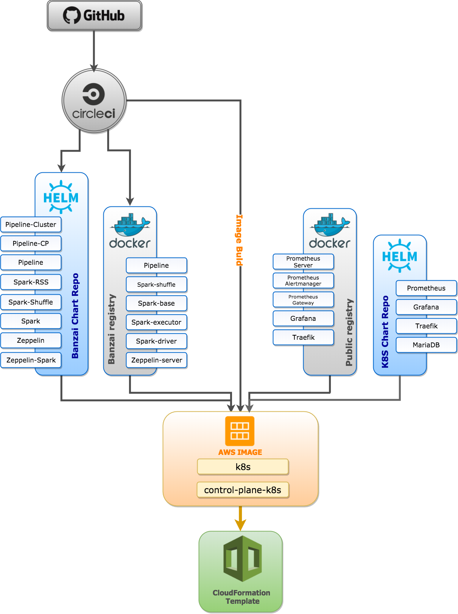
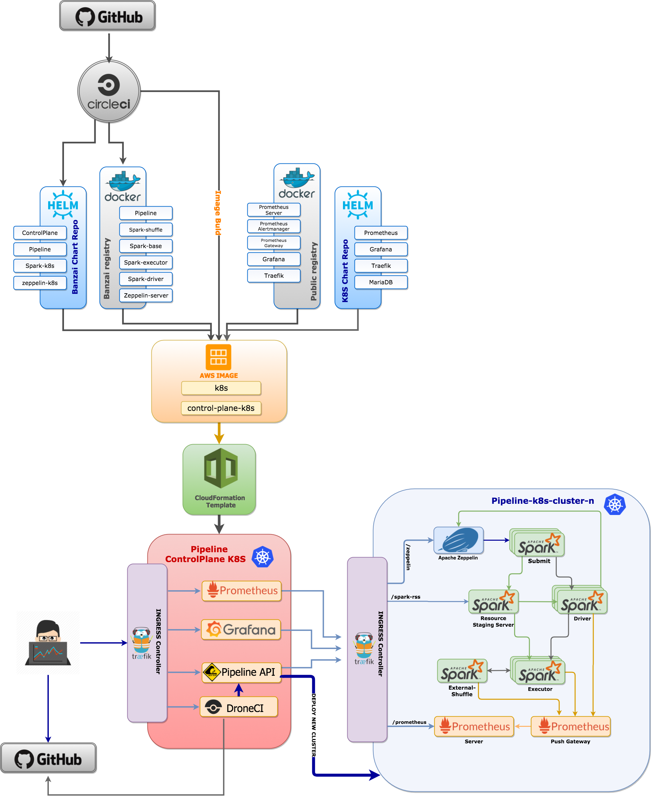

_Banzai Pipeline, or simply Pipeline is a tabletop reef break located in Hawaii, Oahu's North Shore. The most famous and infamous reef on the planet is forming the benchmark by which all other waves are measured._

_Pipeline is a RESTful API to deploy "cloud-native" microservices in public cloud and on-premise. It simplifies and abstracts all the details of provisioning the cloud infrastructure, installing orreusing the Kubernetes cluster and deploying the application._

**Warning:** _Pipeline is experimental, under development and does not have a stable release yet. If in doubt, don't go out._

# Pipeline

The Pipeline API is able to create and configure custom Kubernetes clusters and deploy cloud native applications while taking care about services, ingress, replication and failover. It also monitors the underlying cloud infrastucture, K8S clusters, pods and the application itself.
It is a core building block and engine of the **Pipeline Platform** - an open source PaaS where developers can build, deploy, run, monitor and scale applications. The platform can deploy an application in a few minutes starting with a GitHub commit hook. Based on an application and `infrastructure as code` specification the PaaS supports the full provisioning lifecycle (create, read, delete, update) of the application. Monitoring, SLA based autoscaling, attach to/reuse existing clusters is also included out of the box.
The application specification can be described in a `spotguide`. The platform includes a few `spotguides` by default: Apache Spark, Apache Zeppelin and Apache Kafka.

## Cloud Providers

Pipeline is currently experimental and all the development, testing and the CI/CD pipeline itself is tested on AWS only. The AWS version has all the control plane, cluster images, Cloudformation templates and belonging artifacts published.

The underlying [Kubicorn](kubicorn.io) framework has support for the following providers, and could be used with Pipeline.

  * Google Cloud
  * Microsoft Azure
  * Digital Ocean

## Managed Kubernetes

Pipeline was architected in a way to allow pluggable implementations for providers, managed Kubernetes clusters or hybrid environments. Through provider plugins retrives `kubeconfig` and can connect and deploy applications. Currently it's tested with [Microsoft's Azure managed Kubernetes](https://azure.microsoft.com/en-us/blog/introducing-azure-container-service-aks-managed-kubernetes-and-azure-container-registry-geo-replication/) offering and there is work for the following plugins:

  * Microsoft Azure
  * CoreOS Tectonic
  * Redhat OpenShift

## Architecture overview

Pipeline enforces a typical **cloud native** architecture which takes full advantage of on-demand delivery, global deployment, elasticity, and higher-level services. It enables huge improvements in developer productivity, business agility, scalability, availability, utilization, and cost savings.

It is written in `Go` and built on public cloud provider APIs, Kubernetes, Kubicorn, Helm, Prometheus, Drone, Docker and a few other open source technologies - however all of these are abstracted for the end user behind a secure REST API.
The central component of the Pipeline API is [Kubicorn](kubicorn.io) - a library/cli tool to provision and reconcile Kubernetes clusters in the cloud. Once the infrastructure/K8S cluster is provisioned by Pipeline, it also orchestrates the deployment of the application using Helm charts.
A cluster can be reused and new and updated charts can be redeployed as well - without the need of recreating the cloud infrastructure or the K8S cluster. It supports alerting and autoscaling based on metrics using Prometheus.
By default there are metrics exposing the behaviour of the underlying infrastructure, Kubernetes cluster and the application itself - based on the application specific `spotguide`.

### Control plane

All these components are assembled into a **Control Plane** - and deployed to Kubernetes with Helm, in a public cloud VM(s). A typical control plane - for an out of the box Spark/Zeppelin `spotguide` - looks like this:

You can launch a Pipeline control plane on AWS with the following [Cloudformation](https://github.com/banzaicloud/pipeline-cp-launcher/blob/master/control-plane.template) template.

### Infra, cluster and application deployment

A typical cluster/application deployed with Pipeline - for an out of the box Spark/Zeppelin spotguide - looks like this.

### The Pipeline Platform - PaaS

Although this readme is about the **Pipeline API** itself, in order to briefly show the full picture and understand how Pipeline is a core part and the engine behind, please find below a typical platform overview - again within the context of an out of the box Spark/Zeppelin spotguide.

  

For the platform's end user a typical Pipeline interaction starts with a GitHub commit hook setup. Once the hook is configured (e.g. for branch merge, commit to master, etc.) the only task is to place the Pipeline Platform `descriptor` inside the GitHub repository. The `descriptor` contains information about the desired cluster type (size, kind, storage, etc), the autoscaling/SLA rules, custom monitoring rules (beside the default ones), authentication providers (Pipeline supports OAuth2, thus all providers with JWT token capabilities are supported).

### Installation

Pipeline API deploys microservice based applications using the REST API. Unlike the Pipeline Platform, the API has no explicit knowledge about `spotguides`, the CI/CD pipeline, or the application type. It merely provisions the cloud infrastructure (or reuses), deploys the containers through Helm and applies cluster reconciliation/SLA rules. In order to try the API follow the [installation guide](docs/install.md).

### Create and scale your cluster

Once Pipeline API is started, the easiest way to start, stop, delete or scale a cluster is through the following Postman example.

For alternative ways to create a cluster please follow the [create cluster guide](docs/create.md).

### `Spotguide` specification

In surfing a `spotguide` contains information about the wave, access, surrounding area, hazards and the best swell directions - basically all you need to know about the spot, in an organized and well maintained way.
For Pipeline a `spotguide` is a combination of a few JSON files that describe an application, specify the deployment environment, contain the SLA rules for resilience, autoscaling and failover scenarios, and  describe a runtime analyzer/monitor. `Spotguides` typically examine the application to determine the dependencies and have an understanding of how to build and deploy it. All the Kubernetes and cloud infrastructure related services are configured out of the box - e.g if a service needs ingress (based on the protocol and the application/deployment type) than the `spotguide` downloads, installs, starts and registers those service (e.g. Traefik, AWS ELB, etc).

When you push a code change to GitHub, the Pipeline platform automatically detects the appropriate `spotguide`, reads the descriptors and initiates the pipeline.

#### Apache Spark

One of the default `spotguides` describes an Apache Spark deployment. For further information about the Apache Spark `spotguide` please follow this [guide](docs/spotguides.md).
A typical example of a Spark flow looks like this.

_Note: Spark on Kubernetes does not use YARN, all scheduling and resource management is natively and more efficiently done by the Kuberneres scheduler._

#### Apache Zeppelin

The Apache Zeppelin `spotguide` picks up a change in a Spark notebook and deploys and executes it on Kubernetes/cloud in cluster mode. For further information about the Apache Zeppelin `spotguide` please follow this [guide](docs/spotguides.md)
A typical example of a Zeppelin flow looks like this.

_Note: Zeppelin on Kubernetes for Spark notebooks does not use YARN, all scheduling and resource management is natively and more efficiently done by the Kuberneres scheduler._

#### Apache Kafka

The Apache Kafka `spotguide` has a good understanding of consumers and producers but more importantly it monitors, scales, rebalances and auto-heals the Kafka cluster. It autodetects broker failures, reassigns workloads and edits partition reassignment files.

_Note: Kafka on Kubernetes does not use Zookeper at all. For all quotas, controller election, cluster membership and configuration it is using **etcd**, a faster and more reliable `cloud-native` distributed system for coordination and metadata storage._
