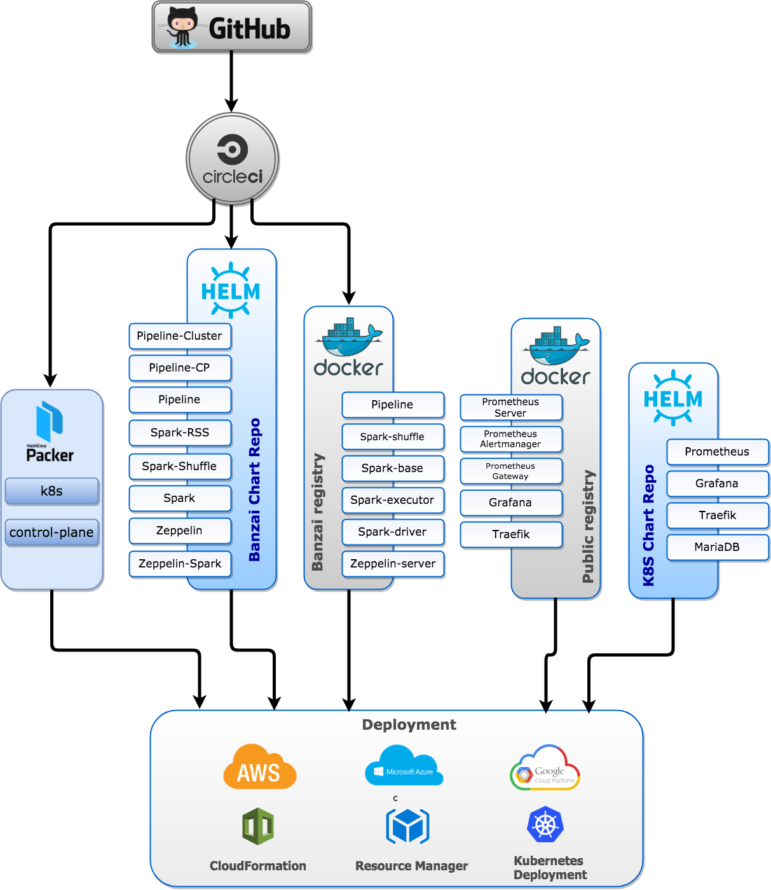
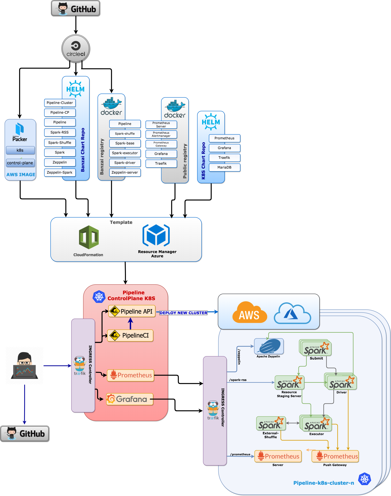
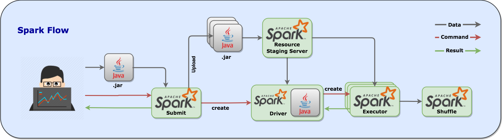
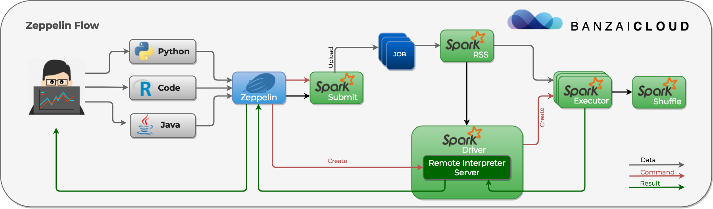
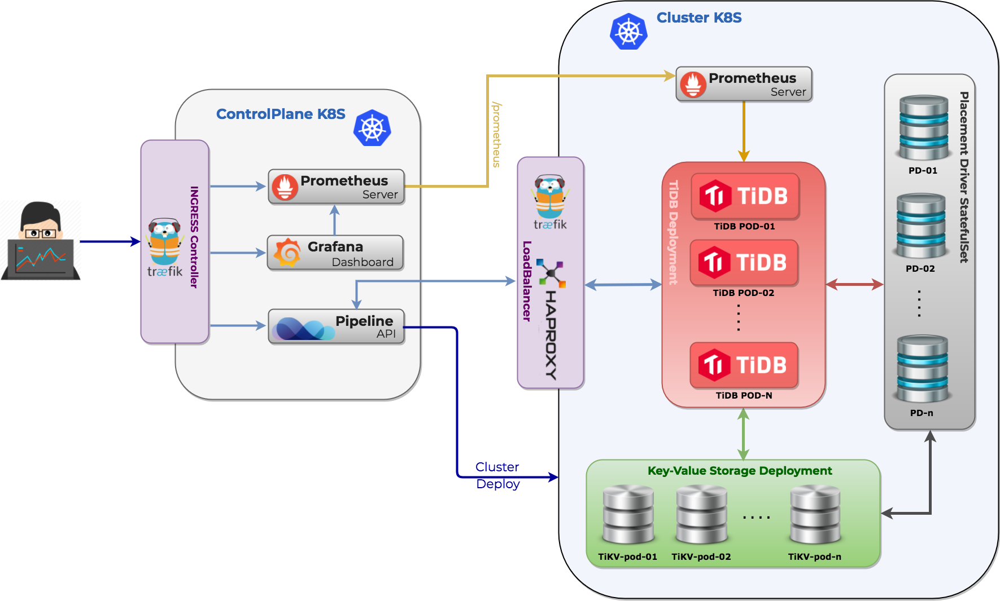
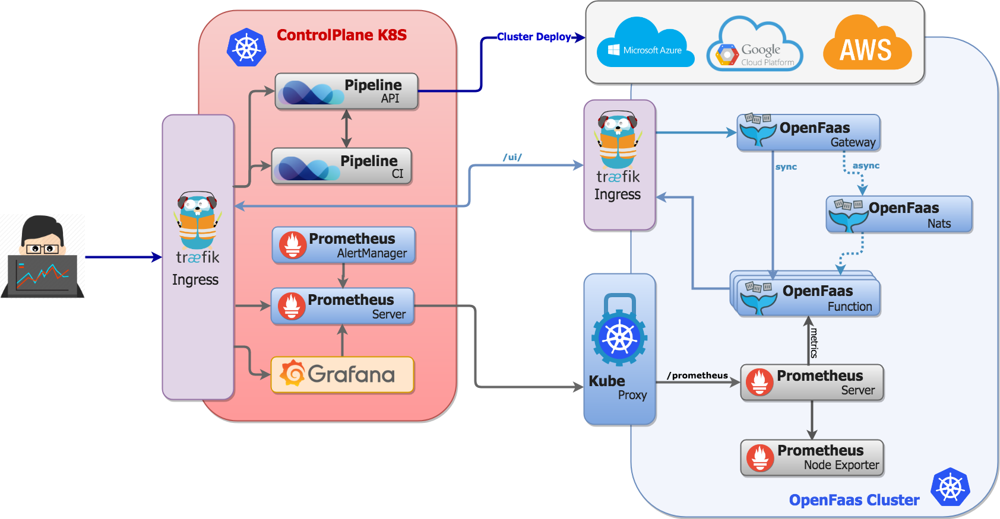
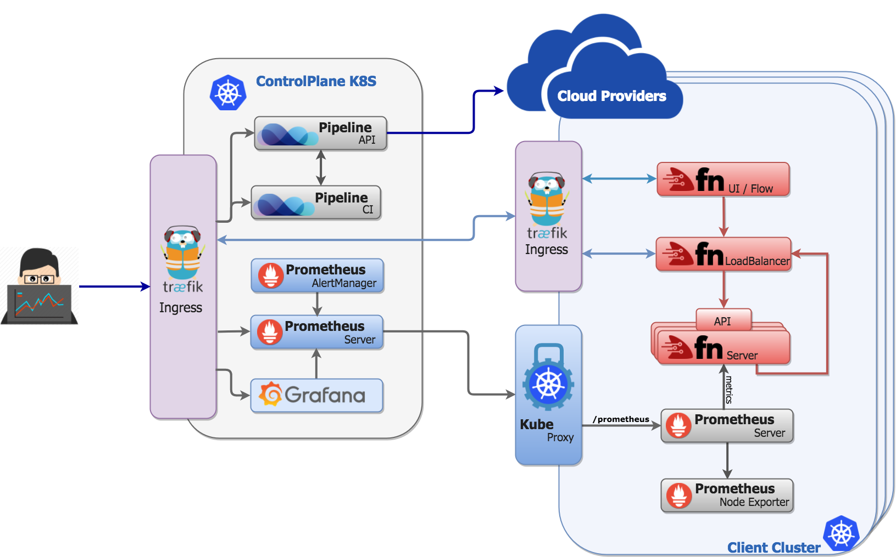

_Banzai Pipeline, or simply Pipeline is a tabletop reef break located in Hawaii, Oahu's North Shore. The most famous and infamous reef on the planet is forming the benchmark by which all other waves are measured._

_Pipeline is a RESTful API to deploy **cloud native** microservices in public cloud and on-premise. It simplifies and abstracts all the details of provisioning the cloud and Kubernetes infrastructure, deploying, monitoring and managing the applications lifecycle._

  

**Warning:** _Pipeline is experimental, under development and does not have a stable release yet. If in doubt, don't go out._

- [Pipeline](#pipeline)
  - [Cloud providers](#cloud-providers)
  - [Managed Kubernetes](#managed-kubernetes)
- [Architecture overview](#architecture-overview)
  - [Control plane](#control-plane)
  - [Deployed clusters](#deployed-clusters)
  - [The Pipeline Platform - PaaS](#the-pipeline-platform-paas)
- [Installation](#installation)
- [API specification](#api-specification)
- [Dependency management](#vendoring)
- [Create Kubernetes clusters](#create-kubernetes-clusters)
  - [Create using the API](#create-using-the-api)
  - [Create using CI/CD](#create-using-cicd)
- [Deploy applications](#application-deployments)
  - [Deploy using the API](#deploy-using-the-api)
  - [Deploy using CI/CD](#deploy-using-cicd)
- [Security](#security)
  - [Authentication](#authentication)
  - [Authorization](#authorization)
  - [Dynamic secrets](#dynamic-secrets)
- [Monitoring](#monitoring)  
- [Centralized logging](#centralized-logging)  
- [Quick howto](#quick-howto)
- [Spotguide specification](#spotguide-specification)
  - [Big data](#big-data)
    - [Apache Spark](#apache-spark)
    - [Apache Zeppelin](#apache-zeppelin)
    - [Apache Kafka](#apache-kafka)
  - [TiDB](#tidb)
  - [Serverless](#serverless)
    - [Fn](#fn)
    - [Kubeless](#kubeless)
    - [OpenFaaS](#openfaas)
- [Reporting bugs](#reporting-bugs)
- [Contributing](#contributing)
- [License](#license)

# Pipeline

The Pipeline API is able to create and configure custom Kubernetes clusters in the cloud and deploy cloud native applications while taking care about services, ingress, network and volume management, replication and failover. It also monitors and autoscales the underlying cloud infrastucture, K8S cluster, pods and the application itself.

It is a core building block and engine of the **Pipeline Platform** - an open source, multi cloud application platform as a service, based on a container management system. It is an application centric approach of a software delivery and deployment pipeline, to build cloud native microservices with confidence. It simplifies and abstracts all the details of provisioning the cloud infrastructure, installing or reusing the managed Kubernetes cluster and building, deploying and monitoring the application. The PaaS includes a full CI/CD workflow, orchestration, SLA rules based autoscaling and advanced networking delivering a complete solution for developers.

The main features of the platform are:

* **Provisioning:** _Provision highly available clusters on any of the supported cloud providers or managed Kubernetes commercial offerings, hybrid cloud or on-premise deployments_
* **Microservice Ready:** _Focus and build great applications and forget the hard stuff of ops, failover, build pipelines, patching and security_
* **Scaling:** _Supports SLA rules for resiliency, failover and autoscaling_
* **Operations support:** _Centralized log collection, tracing and advanced monitoring support for the underlying infrastructure, Kubernetes cluster and the deployed application_
* **Spotguides:** _Understands the application runtime requirements and dependencies, builds the artifacts and pushes to the PaaS while applying the CI/CD pipeline steps with ready to use advanced features (SLA rules, monitoring, alerting, linear regression based predictions)_
* **Hook in:** _Trigger your pipeline with a GitHub Webhook and let the PaaS to build your app, provision or reuse the infrastructure and deploy, monitor and autoscale your deployment_

The platform includes a few default `spotguides` like: **Apache Spark, Apache Zeppelin, TiDB, Apache Kafka, Fn, OpenFaaS, Kubeless, Java/JEE, etc among many others**.

## Cloud Providers

Pipeline is currently experimental and all the development, testing and the CI/CD pipeline itself is tested on **AWS**, **Google** and **Azure** only. The latest version contains the control plane, cloud images, Cloudformation/ARM templates, GKE deployments and belonging artifacts released under the *0.3.0* tag across several repositories. We do `native` Kubernetes installation on AWS, whereas everyhere available we use managed Kubernetes offerings. Pipeline does support `Bring Your Own Cluster`, thus we can adopt and manage any existing Kubernetes cluster.

## Managed Kubernetes

Pipeline is architected in a way to allow pluggable implementations for providers, managed Kubernetes clusters or hybrid environments. Through provider plugins it retrieves the `kubeconfig` and connects and deploys applications. Currently it's tested with [Google Kubernetes Engine](https://cloud.google.com/kubernetes-engine/) and [Microsoft's Azure managed Kubernetes](https://azure.microsoft.com/en-us/blog/introducing-azure-container-service-aks-managed-kubernetes-and-azure-container-registry-geo-replication/).

  * Microsoft AKS
  * Google GKE
  * Amazon EKS

 There is work undergoing for the following plugins:

  * Oracle Managed Kubernetes
  * Redhat OpenShift
  * Alibaba Cloud Managed Kubernetes
  * CoreOS Tectonic
  
## Architecture overview

Pipeline enforces a typical **cloud native** architecture which takes full advantage of on-demand delivery, global deployment, elasticity, and higher-level services. It enables huge improvements in developer productivity, business agility, scalability, availability, utilization, and cost savings.

It is written in `Golang` and built on public cloud provider APIs, Kubernetes, Kubicorn, Helm, Prometheus, Drone, Docker and a few other open source technologies - however all of these are abstracted for the end user behind a secure REST API.
One central component of the Pipeline API is [Kubicorn](http://kubicorn.io) - a library/cli tool to provision and reconcile Kubernetes clusters in the cloud. Once the infrastructure/K8S cluster is provisioned by Pipeline, it also orchestrates the deployment of the application using Helm charts.
A cluster can be reused and new and updated charts can be redeployed as well - without the need of recreating the cloud infrastructure or the K8S cluster. It supports alerting and autoscaling based on metrics using Prometheus.
By default there are metrics and Grafana dashboards exposing the behaviour of the underlying infrastructure, Kubernetes cluster and the application itself - based on the application specific `spotguide`.

### Control plane

The Pipeline Control Plane is the central location where all the components of the [Pipeline PaaS](https://banzaicloud.com/platform/) are assembled together and it runs all the services we provide (CI/CD, authentication, log collection, monitoring, dashboards, and application registries/spotguide definitions). The control plane itself is a Kubernetes deployment as well, and it's cloud agnostic - currently there are out of the box deployments for [AWS](https://github.com/banzaicloud/pipeline-cp-launcher/blob/master/README.md#pipeline-control-plane-launcher-on-aws), [Azure](https://github.com/banzaicloud/pipeline-cp-launcher/blob/master/README.md#pipeline-control-plane-launcher-on-azure), [Google](https://github.com/banzaicloud/pipeline-cp-launcher/blob/master/README.md#pipeline-control-plane-launcher-on-google-cloud) and for [Minikube](https://github.com/banzaicloud/pipeline-cp-launcher/blob/master/README.md#pipeline-control-plane-launcher-on-minikube) (for local/dev purpose).

All these components are assembled into a **Control Plane** - and deployed to Kubernetes with Helm. A typical control plane - with a Spark/Zeppelin `spotguide` deployment looks like this:

To launch a Pipeline control plane on one of the supported provider please follow this [documentation](https://github.com/banzaicloud/pipeline-cp-launcher/blob/master/README.md).

### Deployed clusters

A typical cluster/application deployed with Pipeline - as an example using Spark/Zeppelin spotguide deployment - looks like this.

### The Pipeline Platform PaaS

Although this readme is about the **Pipeline API** itself, in order to briefly show the full picture and understand how Pipeline is a core part and the engine behind, please find below a typical platform overview - again within the context of an out of the box Spark/Zeppelin spotguide.

  

For the platform's end user a typical Pipeline interaction starts with a GitHub commit hook setup. Once the hook is configured (e.g. for branch merge, commit to master, etc.) the only task is to place the Pipeline Platform `descriptor` inside the GitHub repository. The `descriptor` contains information about the desired cluster type (size, kind, storage, etc), the autoscaling/SLA rules, custom monitoring rules (beside the default ones), authentication providers (Pipeline supports OAuth2, thus all providers with JWT token capabilities are supported).

### Installation

Pipeline API deploys microservice based applications using the REST API. Unlike the Pipeline Platform, the API has no explicit knowledge about `spotguides`, the CI/CD pipeline, or the application type. It merely provisions (or reuses) the cloud infrastructure, deploys the containers through Helm and applies cluster reconciliation/SLA rules. In order to try the API follow the [installation guide](docs/pipeline-howto.md).

### Vendoring

Vendoring all dependencies is essential to have a **go get**-able package. Go vendoring in combination with Kubernetes is quiet tricky - we came up with a `solution` described in [dependency management guide](docs/deps.md).

### API specification

Pipeline is using OpenAPI 3.0 to specify the API, and it's compatible with all Swagger tooling. The get the specification please follow this [link](https://github.com/banzaicloud/pipeline/blob/master/docs/openapi/pipeline.yaml).

#### Generated API clients

Based on our OpenAPI 3.0 descriptor we have generated language clients for different languages:

- [Go](https://github.com/banzaicloud/pipeline/blob/master/client/README.md)

### Create Kubernetes clusters

Once Pipeline is started, it can create Kubernetes clusters on all cloud providers using a RESTful API. Kubernetes clusters can be created declaratively (directly triggered by calling the API) or part of a CI/CD flow (where the cluster is created on demand as part of the flow).

#### Create using the API

The easiest way to create a Kubernetes cluster on one of the supported cloud providers is by using the REST API, available as a Postman collection. Clusters can be created, updated or deleted.

The easiest way to deploy applications to it is through the following Postman examples.

#### Create using CI/CD

Pipeline has an in-built CI/CD system. Once the GitHub repository is configured with a commit hook, Pipeline can automatically clone, build and deploy the applications. The Kubernetes clusters are created (or reaused) on demand as part of the CI/CD flow. For a CI/CD example please follow this [CI/CD guide](docs/pipeline-howto.md#define-pipeline-workflow-configuration-for-your-spark-application).

For alternative ways to create a cluster please follow the [create cluster guide](docs/create.md).

### Application deployments

Once Pipeline is started, it can deploy applications using a RESTful API from any Helm repository or using the in-built CI/CD system. 

#### Deploy using the API

We have introduced a new feature where beside CLI and gRPC a RESTful API can be used to deploy applications packegd with Helm.

The easiest way to deploy applications to it is through the following Postman examples.

#### Deploy using CI/CD

Pipeline has an in-built CI/CD system. Once the GitHub repository is configured with a commit hook, Pipeline can automatically clone, build and deploy the applications. For further CI/CD example please follow this [CI/CD guide](docs/pipeline-howto.md#define-pipeline-workflow-configuration-for-your-spark-application).

For alternative ways to learn about application deployments please follow the [deployments guide](docs/deployments.md).

### Security

#### Authentication 

For `Authentication` Pipeline uses [OAuth2](https://oauth.net/2/) via delegating user authentication to the service that hosts the user account. There are plenty of OAuth2 identity providers out there: GitHub, Google, Facebook, Azure Active Directory, Twitter and Salesforce to mention only the biggest ones. At this time in Pipeline there is support for GitHub, mainly due to the fact that our [CI/CD component](https://banzaicloud.com/blog/pipeline-howto/) is triggered by GitHub events, but we are using the very flexible [QOR](github.com/qor/auth) package which supports many major providers as a `plugin` mechanism, so it is just a matter of a configuration change to have support for the providers above (beside oldschool username/passwords). The main benefit of this solution is that we **don't have to store any user credentials** and our users can use their existing accounts at these sites to access our service. The OAuth2 flow can be seen in this diagram. When a user hits [Pipeline](https://github.com/banzaicloud/pipeline), they have to first login with GitHub to have a user record created in the RDBMS - the REST endpoint for that is: `https://$HOST/auth/login`.

#### Bearer tokens - JWT 

[JWT token](https://jwt.io) which is a really good candidate for being a [Bearer token](https://jwt.io/introduction/). Note that JWT is based on the [RFC 7519](https://tools.ietf.org/html/rfc7519) standard. The main benefit of JWT is that is `self-contained`, so it allows stateless authentication. The server's protected routes will check for a valid JWT in the Authorization header and if it's present the user will be allowed to access protected resources based on the `scopes` field of the token. JWT is stateless unless you would like to allow users to `revoke` the generated tokens immediately (so not waiting until the token expires). To be able to revoke JWT tokens you have to maintain a blacklist or a whitelist where you store all revoked or valid tokens. 

#### Vault 

For the purpose of storeing tokens we choose HashiCorp's Vault. However there was another major contributor to the decision to standardize on Vault: Vault’s nice integration with the [Kubernetes Authentication API](https://www.vaultproject.io/docs/auth/kubernetes.html). After Vault is started, the Kubernetes auth backend has to be enabled and configured, and with that Vault can `lease` tokens to be able to use its API based on **ServiceAccount JWT tokens**. This enables other applications running in the same Kubernetes cluster to call Vault and with this we can use `tightly scoped tokens` with various TTLs.

#### Authorization

Pipeline is integrated with the [Casbin](https://github.com/casbin/) framework to provide fine grained policy enforcements with support for different access control models: 

* ACL (access control lists)
* RBAC (role-based access control)
* ABAC (attribute-based access control)
* RESTful (with `path` support and all HTTP verbs)

#### Dynamic secrets 

Vault does support dynamic secrets thus decided to add support and make the out of the box solution for all our supported deployments. To harden security each application gets a dedicated credential towards the requested service, this credential only belongs to the requesting application and has a fixed expiry time. Because the credential is dedicated it is possible to track down which application accessed the service and when and it is easy to revoke it because they are managed at a central place, Vault. Since Pipeline is running on Kubernetes we can apply Kubernetes Service Account based authentication to get the Vault tokens first which we can later exchange for a credential (username/password) based on our configured Vault role. Please see this diagram for further details about the sequence of events:

As you can see with this solution [Pipeline](https://github.com/banzaicloud/pipeline) became able to connect to (e.g.) MySQL simply because it is running in the configured **Kubernetes Service Account** and without being required to type a single username/password during the configuration of the application.

The code implementing the dynamic secret allocation for database connections and Vault configuration described above can be found in our open sourced project [Bank-Vaults](https://github.com/banzaicloud/bank-vaults/tree/master).

### Monitoring

Pipeline by default monitors the infrastructure, Kubernetes cluster and applications deployed with `spotguides`. We use Prometheus and we deploy federated Prometheus clusters (using TLS) to securely monitor the infrastructure. We deploy default Grafana dashboards and alerts based on the cluster layout and applications provisioned. Nevertheless, these can always be changed. For further information about monitoring please follow up these [posts](https://banzaicloud.com/tags/prometheus/).

 

### Centralized logging

We are using fluentd and fluent-bit to move application logs towards a centralized location. To collect all logs we deploy fluent-bit as a `DaemonSet`. These pods will mount the Docker container logs from the Host machine and transfer to the Fluentd service for further transformations. For further information about log collection please follow up these [posts](https://banzaicloud.com/tags/logging/).

  

### Quick howto

To do a step by step installation there is a detailed howto available [here](docs/pipeline-howto.md).

### `Spotguide` specification

In surfing a `spotguide` contains information about the wave, access, surrounding area, hazards and the best swell directions - basically all you need to know about the spot, in an organized and well maintained way.

>Spotguides are not part of the Pipeline project and this repository. They are nothing else but a collection of yaml files and custom CI/CD plugins written in Go.

For Pipeline a `spotguide` is a combination of a few yaml files that describe an application, specify the deployment environment, contain the SLA rules for resilience, autoscaling and failover scenarios, and  describe a runtime analyzer/monitor. `Spotguides` typically examine the application to determine the dependencies and have an understanding of how to build and deploy it. All the Kubernetes and cloud infrastructure related services are configured out of the box - e.g if a service needs ingress (based on the protocol and the application/deployment type) than the `spotguide` downloads, installs, starts and registers those service (e.g. Traefik, AWS ELB, etc).

When you push a code change to GitHub, the Pipeline platform automatically detects the appropriate `spotguide`, reads the descriptors and initiates the pipeline.

#### Big data

Pipeline PaaS allows enterprises to shift from a host-centric infrastructure to one that is container and application centric and take advantage of containers’ portability and flexibility. Today's big data frameworks require a scheduler (Apache YARN) and a distributed coordination framework (Apache Zookeeper) however better alternatives are already key building blocks of Kubernetes. Running big data workloads on the Pipeline PaaS removes all the requirements to use, install and maintain these systems and provide a cloud native way to run, schedule and scale the workload. The Kubernetes scheduler is aware of the application state and understands the infrastructure and cluster as well. A better density, utilization, broader range of workloads and varying latency  are all among the benefits.

#### Apache Spark

One of the default `spotguides` describes an Apache Spark deployment. For further information about the Apache Spark `spotguide` please follow this [guide](docs/spotguides.md).
A typical example of a Spark flow is this.

_Note: Spark on Kubernetes does not use YARN, all scheduling and resource management is natively and more efficiently done by the Kuberneres scheduler._

#### Apache Zeppelin

The Apache Zeppelin `spotguide` picks up a change in a Spark notebook and deploys and executes it on Kubernetes in cluster mode. For further information about the Apache Zeppelin `spotguide` please follow this [guide](docs/spotguides.md)
A typical example of a Zeppelin flow is this.

_Note: Zeppelin on Kubernetes for Spark notebooks does not use YARN, all scheduling and resource management is natively and more efficiently done by the Kuberneres scheduler._

#### Apache Kafka

The Apache Kafka `spotguide` has a good understanding of consumers and producers but more importantly it monitors, scales, rebalances and auto-heals the Kafka cluster. It autodetects broker failures, reassigns workloads and edits partition reassignment files.

_Note: Kafka on Kubernetes does not use Zookeper at all. For all quotas, controller election, cluster membership and configuration it is using **etcd**, a faster and more reliable `cloud-native` distributed system for coordination and metadata storage._

#### TiDB

The TiDB `spotguide` provisions, runs, scales and monitors a TiDB cluster (TiDB, TiKV, PD) on the Pipeline PaaS. It detects failures and auto-scales, heals or rebalances the cluster.

#### Serverless

The serverless/function as a service `spotguide` provisions the selected serverless framework (Fn, OpenFaaS or Kubeless) and deploys it to Pipeline PaaS. The `function as a service` flow can be triggered with the frameworks native tooling (UI or CLI) however next Pipeline releases will contain a unified serverless API to trigger a function on any of the prefered frameworks with unified tooling (Pipeline API, UI and CLI).

##### OpenFaaS

##### Fn 

##### Kubeless

### Reporting bugs

In case you have problems please open an [issue](https://github.com/banzaicloud/pipeline/issues) on GitHub. Please note that _Pipeline is experimental, under development and does not have a stable release yet. If in doubt, don't go out._

### Contributing

Thanks you for your contribution and being part of our community. Please read [CONTRIBUTING.md](CONTRIBUTING.md) for details on the code of conduct, and the process for submitting pull requests. When you are opening a PR to Pipeline the first time we will require you to sign a standard CLA.

### License

Pipeline is open sourced under the Apache 2.0 license. See the [LICENSE](LICENSE.md) file for details.
