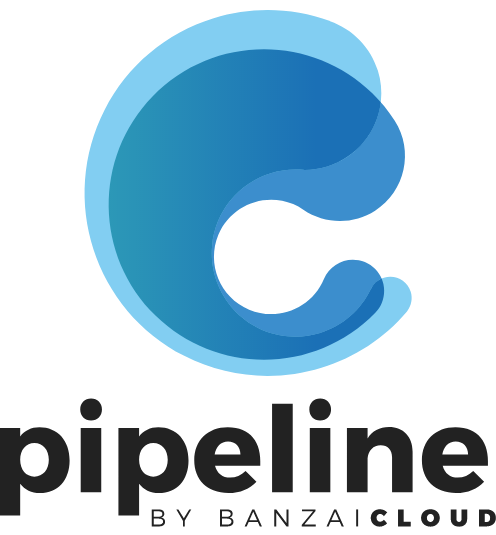

 

    

_Banzai Pipeline, or simply Pipeline is a tabletop reef break located in Hawaii, Oahu's North Shore. The most famous and infamous reef in the universe is the benchmark by which all other waves are measured._

_Banzai Cloud Pipeline is a solution-oriented application platform which allows enterprises to develop, deploy and securely scale container-based applications in multi- and hybrid-cloud environments._

# Pipeline

Banzai Cloud Pipeline is a solution-oriented application platform which allows enterprises to develop, deploy and securely scale container-based applications in multi- and hybrid-cloud environments.

The main features of the platform are:

* **Provisioning:** _Provision highly available Kubernetes clusters on cloud providers, on-premise or hybrid configurations_
* **Multi and Hybrid clouds:** _Avoid lock in and move between providers and build hybrid clouds in four different ways_
* **Integrates cluster services:** _Automated solutions for DNS, observability, private registries, security scans, DR and lots more_
* **Hook in:** _Go from commit to scale in minutes using the in-built container-native CI/CD workflow engine_

Check out the developer preview environment if you would like to try out the platform:

  

## Provisioning

Pipeline supports all major cloud providers (either provider managed Kubernetes or our own CNCF certified Kubernetes distribution, [PKE](https://github.com/banzaicloud/pke) and on-premise setups (VMware, bare metal).

  * Amazon 
  * Google 
  * Microsoft 
  * VMware

Pipeline does support `BYOK` - `Bring Your Own Kubernetes` and can adopt and manage existing Kubernetes clusters as well. 

## Resources

### Installation

If you want to install Pipeline for evaluation or production usage, please read our [quickstart guide](https://banzaicloud.com/docs/pipeline/quickstart/).

Pipeline can be installed locally for development by following the [development guide](docs/developer.md).

### Documentation

You can find the documentation for operators and users of the platform at [banzaicloud.com](https://banzaicloud.com/docs/pipeline/).

### API specification

Pipeline API is described using the OpenAPI 3.0 specification (formerly Swagger). The get the specification please follow this [link](https://github.com/banzaicloud/pipeline/blob/master/apis/pipeline/pipeline.yaml).

### Generated API clients

Based on our OpenAPI 3.0 descriptor we have generated language clients for different languages:

- [Go](https://github.com/banzaicloud/pipeline/blob/master/client/README.md)

### Postman 

You can test the REST API using the Postman collection. 

## Quick try

The easiest to kickstart your Pipeline experience is by trying out our free developer version of the Pipeline platform at: 

  

### Contributing

Thanks you for your contribution and being part of our community. Please read [CONTRIBUTING.md](https://github.com/banzaicloud/.github/blob/master/CONTRIBUTING.md) for details on the code of conduct, and the process for submitting pull requests. When you are opening a PR to Pipeline the first time we will require you to sign a standard CLA.

### License

Copyright (c) 2017-2019 [Banzai Cloud, Inc.](https://banzaicloud.com)

Licensed under the Apache License, Version 2.0 (the "License");
you may not use this file except in compliance with the License.
You may obtain a copy of the License at

[http://www.apache.org/licenses/LICENSE-2.0](http://www.apache.org/licenses/LICENSE-2.0)

Unless required by applicable law or agreed to in writing, software
distributed under the License is distributed on an "AS IS" BASIS,
WITHOUT WARRANTIES OR CONDITIONS OF ANY KIND, either express or implied.
See the License for the specific language governing permissions and
limitations under the License.
