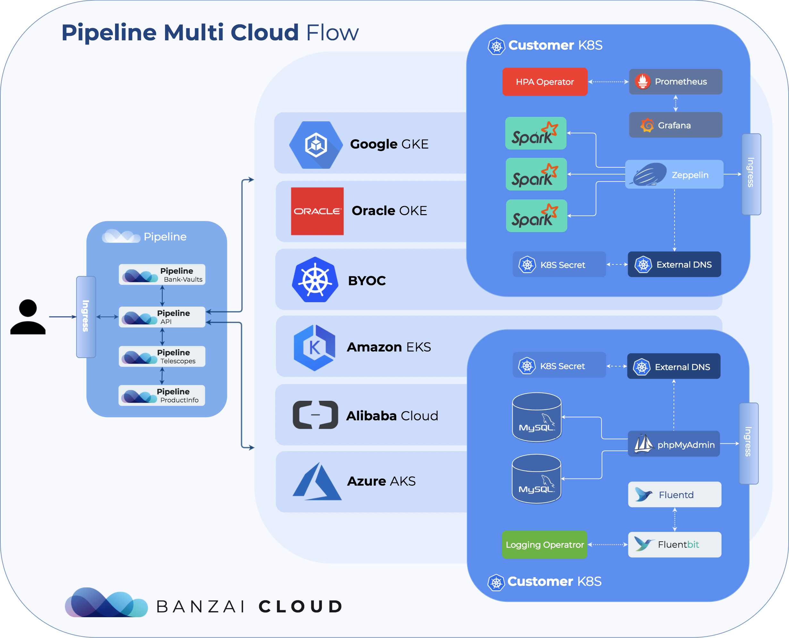
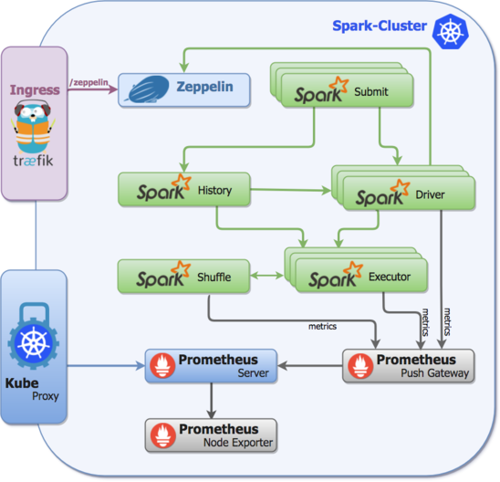
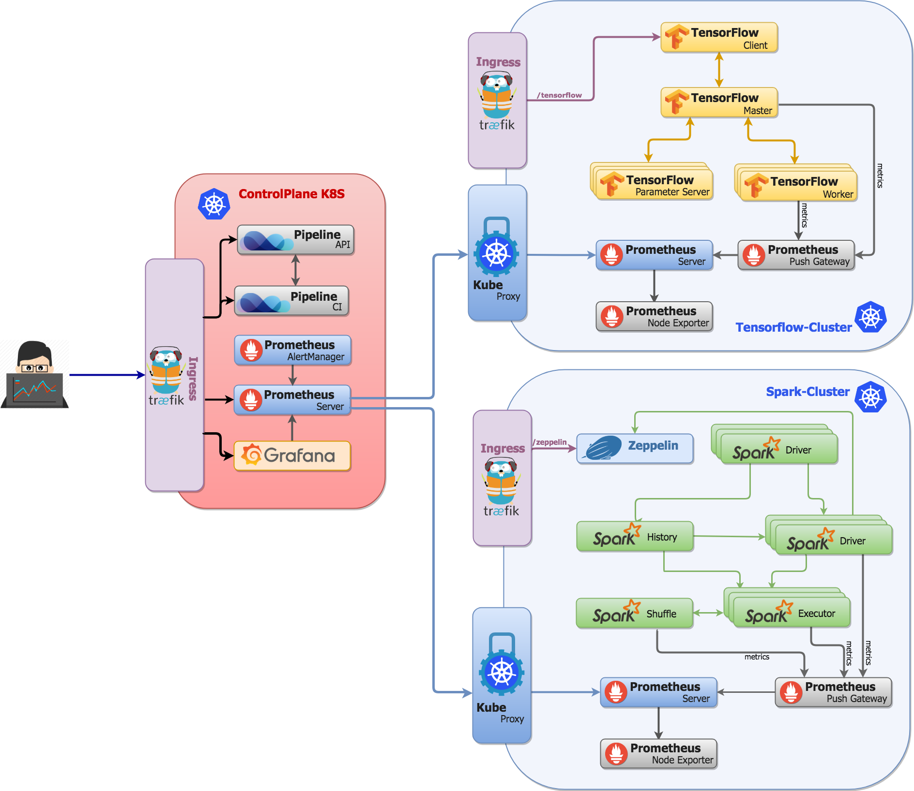
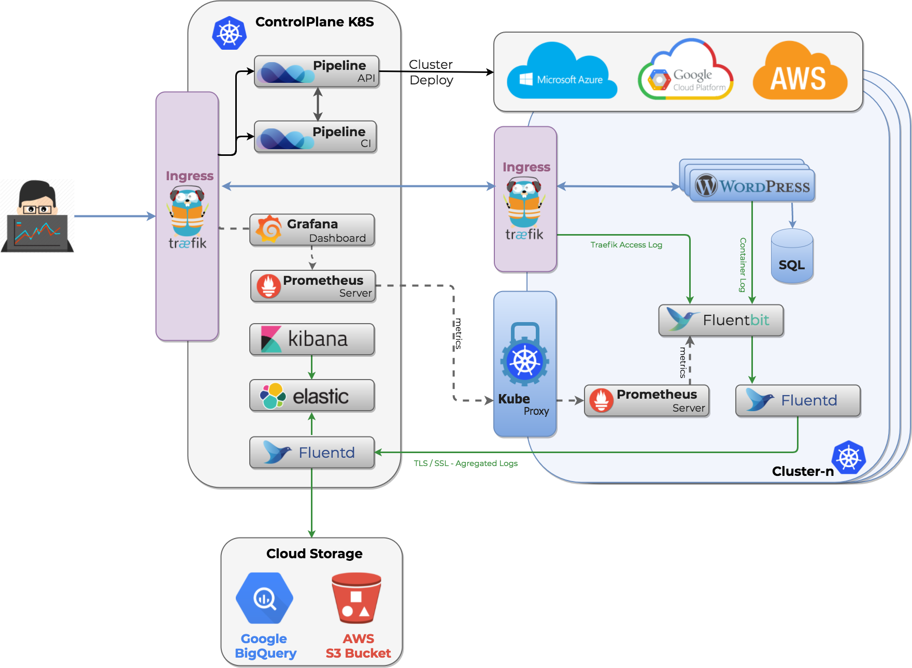

_Banzai Pipeline, or simply Pipeline is a tabletop reef break located in Hawaii, Oahu's North Shore. The most famous and infamous reef in the universe is the benchmark by which all other waves are measured._

_Pipeline enables developers to go from commit to scale in minutes by turning Kubernetes into a feature rich application platform integrating CI/CD, centralized logging, monitoring, enterprise-grade security, cost management and autoscaling._

- [Pipeline](#pipeline)
  - [Cloud providers](#cloud-providers)
- [Architecture overview](#architecture-overview)
  - [Control plane](#control-plane)
  - [Provisioned clusters](#provisioned-clusters)
- [Installation](#installation)
- [API specification](#api-specification)
- [Dependency management](#vendoring)
- [Create Kubernetes clusters](#create-kubernetes-clusters)
  - [Create using the API](#create-using-the-api)
  - [Create using CI/CD](#create-using-cicd)
- [Deploy applications](#application-deployments)
  - [Deploy using the API](#deploy-using-the-api)
  - [Deploy using CI/CD](#deploy-using-cicd)
- [Security](#security)
  - [Authentication](#authentication)
  - [Authorization](#authorization)
  - [Dynamic secrets](#dynamic-secrets)
- [Monitoring](#monitoring)  
- [Centralized logging](#centralized-logging)  
- [Operators](#operators)
- [Quick howto](#quick-howto)
- [Reporting bugs](#reporting-bugs)
- [Contributing](#contributing)
- [License](#license)

# Pipeline

Pipeline is a feature rich **application platform**, built for containers on top of Kubernetes to automate the DevOps experience, continuous application development and the lifecycle of deployments. Pipeline enables developers to go from commit to scale in minutes by turning Kubernetes into a feature rich application platform integrating CI/CD, centralized logging, monitoring, enterprise-grade security and autoscaling.

The main features of the platform are:

* **Provisioning:** _Provision highly available Kubernetes clusters on any of the supported cloud providers, on-premise or hybrid configurations_
* **Application focused:** _Focus on building great applications and leave the hard stuff of ops, failover, build pipelines, patching and security to Banzai Pipeline_
* **Scaling:** _Supports SLA rules for resiliency, failover and autoscaling_
* **Observability:** _Centralized log collection, tracing and advanced monitoring support for the infrastructure, Kubernetes cluster and the deployed applications_
* **Hook in:** _Go from commit to scale in minutes using our container-native CI/CD workflow engine_
* **Spotguides:** _Use your favorite development framework and let Pipeline automate the rest_

Check out the developer beta if you would like to try out the platform:

  

## Cloud Providers

Banzai Cloud supports Kubernetes and the container based application platform - Pipeline - on all major providers in a way that makes portability between vendors as easy as possible, seamless and automated. 

The list of currently supported providers are:

  * Alibaba ACK
  * Amazon EKS
  * Google GKE
  * Microsoft AKS
  * Oracle OKE

Pipeline does support `BYOC - Bring Your Own Cluster` and can adopt and manage existing Kubernetes clusters as well. 

 There is work undergoing for the following providers:

  * Digital Ocean DOK

## Architecture overview

Pipeline enforces a typical **cloud native** architecture which takes full advantage of on-demand delivery, global deployment, elasticity, and higher-level services. It enables huge improvements in developer productivity, business agility, scalability, availability, utilization, and cost savings.

It is written in Golang and built on public cloud provider APIs, Kubernetes, Helm, Prometheus, Grafana, Docker, Vault and a few other open source technologies from the CNCF landscape - however all of these are abstracted for the end user behind a secure REST API, UI or CLI.

### Control plane

The Pipeline Control Plane is the central location where all the components of the [Pipeline Platform](https://banzaicloud.com/platform/) are assembled together and it runs all the provided services as CI/CD, authentication, log collection, monitoring, dashboards, application registries, spotguide definitions, security scans and more. The control plane itself is a Kubernetes deployment as well, and it's cloud agnostic - currently there are out of the box deployments for [AWS](https://github.com/banzaicloud/pipeline-cp-launcher/blob/master/README.md#pipeline-control-plane-launcher-on-aws), [Azure](https://github.com/banzaicloud/pipeline-cp-launcher/blob/master/README.md#pipeline-control-plane-launcher-on-azure), [Google](https://github.com/banzaicloud/pipeline-cp-launcher/blob/master/README.md#pipeline-control-plane-launcher-on-google-cloud) and for [Minikube](https://github.com/banzaicloud/pipeline-cp-launcher/blob/master/README.md#pipeline-control-plane-launcher-on-minikube) (for local/dev purpose).

A default control plane deployment looks like this:

To launch a Pipeline control plane on one of the supported provider please follow this [documentation](https://github.com/banzaicloud/pipeline-cp-launcher/blob/master/README.md).

### Provisioned clusters

A typical cluster/application deployed with Pipeline - as an example using Spark/Zeppelin `spotguide` deployment - looks like this.

### Installation

In order to try the API follow this [installation guide](docs/pipeline-howto.md).

### Vendoring

Vendoring all dependencies is essential to have a **go get**-able package. Please follow our [dependency management](docs/deps.md) guideline for more details.

### API specification

Pipeline API is described using the OpenAPI 3.0 specification (formerly Swagger). The get the specification please follow this [link](https://github.com/banzaicloud/pipeline/blob/master/docs/openapi/pipeline.yaml).

#### Generated API clients

Based on our OpenAPI 3.0 descriptor we have generated language clients for different languages:

- [Go](https://github.com/banzaicloud/pipeline/blob/master/client/README.md)

### Create Kubernetes clusters

Kubernetes clusters can be created explicitly (directly triggered by calling the API), part of our CI/CD flow (where the cluster is created on demand as part of the flow) or deployments.

#### Create using the API

The easiest way to create a Kubernetes cluster on one of the supported cloud providers is by using the REST API, available as a Postman collection. Clusters can be created, updated or deleted.

#### Create using CI/CD

Pipeline has an in-built CI/CD system. Once the GitHub repository is configured with a commit hook, Pipeline can automatically clone, build and deploy the applications. The target Kubernetes clusters are created (or reused) on demand as part of the CI/CD flow. For a CI/CD example please follow this [CI/CD guide](docs/pipeline-howto.md#define-pipeline-workflow-configuration-for-your-spark-application). The CI/CD flow does static code analysis and image security scans as well.

For alternative ways to create a cluster please follow the [create cluster guide](docs/create.md).

### Application deployments

Once Pipeline is started, it can deploy applications using a RESTful API from any Helm repository or using the in-built CI/CD engine.

#### Deploy using the API

We have introduced a new feature where beside the Helm CLI and gRPC a RESTful API can be used to deploy applications packaged with Helm.

The easiest way to deploy applications to it is through the following Postman examples.

#### Deploy using CI/CD

For further CI/CD example please follow this [CI/CD guide](docs/pipeline-howto.md#define-pipeline-workflow-configuration-for-your-spark-application).

For alternative ways to learn about application deployments please follow the [deployments guide](docs/deployments.md).

### Security

#### Authentication

For `Authentication` Pipeline uses [OAuth2](https://oauth.net/2/) via delegating user authentication to the service that hosts the user account. There are plenty of OAuth2 identity providers out there: GitHub, Google, Facebook, Azure Active Directory, Twitter and Salesforce to mention only the biggest ones. At this time in Pipeline there is support for GitHub, mainly due to the fact that our [CI/CD component](https://banzaicloud.com/blog/pipeline-howto/) is triggered by GitHub events, but we are using the very flexible [QOR](github.com/qor/auth) package which supports many major providers as a `plugin` mechanism, so it is just a matter of a configuration change to have support for the providers above (beside oldschool username/passwords). The main benefit of this solution is that we **don't have to store any user credentials** and our users can use their existing accounts at these sites to access our service. The OAuth2 flow is highlighted in this diagram. When a user hits [Pipeline](https://github.com/banzaicloud/pipeline), they have to first login with GitHub to have a user record created in the RDBMS - the REST endpoint for that is: `https://$HOST/auth/login`.

#### Bearer tokens - JWT

[JWT token](https://jwt.io) is a really good candidate for being a [Bearer token](https://jwt.io/introduction/). Note that JWT is based on the [RFC 7519](https://tools.ietf.org/html/rfc7519) standard. The main benefit of JWT is that is `self-contained`, so it allows stateless authentication. The server's protected routes will check for a valid JWT in the Authorization header and if it's present the user will be allowed to access protected resources based on the `scopes` field of the token. JWT is stateless unless you would like to allow users to `revoke` the generated tokens immediately (so not waiting until the token expires). To be able to revoke JWT tokens you have to maintain a blacklist or a whitelist where you store all revoked or valid tokens.

#### Vault

For the purpose of storing tokens we choose HashiCorp's Vault. However there was another major contributor to the decision to standardize on Vault: Vault’s nice integration with the [Kubernetes Authentication API](https://www.vaultproject.io/docs/auth/kubernetes.html). After Vault is started, the Kubernetes auth backend has to be enabled and configured, and with that Vault can `lease` tokens to be able to use its API based on **ServiceAccount JWT tokens**. This enables other applications running in the same Kubernetes cluster to call Vault and with this we can use `tightly scoped tokens` with various TTLs.

#### Dynamic secrets

Vault does support dynamic secrets thus decided to add support and make the out of the box solution for all our supported deployments. To harden security each application gets a dedicated credential towards the requested service, this credential only belongs to the requesting application and has a fixed expiry time. Because the credential is dedicated it is possible to track down which application accessed the service and when and it is easy to revoke it because they are managed at a central place, Vault. Since Pipeline is running on Kubernetes we can apply Kubernetes Service Account based authentication to get the Vault tokens first which we can later exchange for a credential (username/password) based on our configured Vault role. Please see this diagram for further details about the sequence of events:

As you can see with this solution [Pipeline](https://github.com/banzaicloud/pipeline) became able to connect to (e.g.) MySQL simply because it is running in the configured **Kubernetes Service Account** and without being required to type a single username/password during the configuration of the application.

The code implementing the dynamic secret allocation for database connections and Vault configuration described above can be found in our open sourced project [Bank-Vaults](https://github.com/banzaicloud/bank-vaults/tree/master).

### Monitoring

Pipeline by default monitors the infrastructure, Kubernetes cluster and the applications deployed. We use Prometheus and we deploy federated Prometheus clusters (using TLS) to securely monitor the infrastructure. We deploy default Grafana dashboards and alerts based on the cluster layout and applications provisioned. For further information about monitoring please follow up these [posts](https://banzaicloud.com/tags/prometheus/).

### Centralized logging

We are using fluentd and fluent-bit to move application logs towards a centralized location. To collect all logs we deploy fluent-bit as a `DaemonSet`. These pods will mount the Docker container logs from the Host machine and transfer to the Fluentd service for further transformations. For further information about log collection please follow up these [posts](https://banzaicloud.com/tags/logging/).

  

### Operators

Pipeline installs and runs Kubernetes operators to bring human operational knowledge into code. There are (cloud agnostic) operators supporting deployments, storage management, autoscaling and more.

 * [Logging operator](https://github.com/banzaicloud/logging-operator)
 * [PVC operator](https://github.com/banzaicloud/pvc-operator)
 * [HPA autoscaling operator](https://github.com/banzaicloud/hpa-operator)
 * [Prometheus JMX exporter operator](https://github.com/banzaicloud/prometheus-jmx-exporter-operator)

### Quick howto

To get a Banzai Cloud Control Plane instance up and running quickly follow [these](https://beta.banzaicloud.io/docs/installer/) installation steps.

### Reporting bugs

In case you have problems please open an [issue](https://github.com/banzaicloud/pipeline/issues) on GitHub. 

### Contributing

Thanks you for your contribution and being part of our community. Please read [CONTRIBUTING.md](https://github.com/banzaicloud/.github/blob/master/CONTRIBUTING.md) for details on the code of conduct, and the process for submitting pull requests. When you are opening a PR to Pipeline the first time we will require you to sign a standard CLA.

### License

Copyright (c) 2017-2019 [Banzai Cloud, Inc.](https://banzaicloud.com)

Licensed under the Apache License, Version 2.0 (the "License");
you may not use this file except in compliance with the License.
You may obtain a copy of the License at

[http://www.apache.org/licenses/LICENSE-2.0](http://www.apache.org/licenses/LICENSE-2.0)

Unless required by applicable law or agreed to in writing, software
distributed under the License is distributed on an "AS IS" BASIS,
WITHOUT WARRANTIES OR CONDITIONS OF ANY KIND, either express or implied.
See the License for the specific language governing permissions and
limitations under the License.
