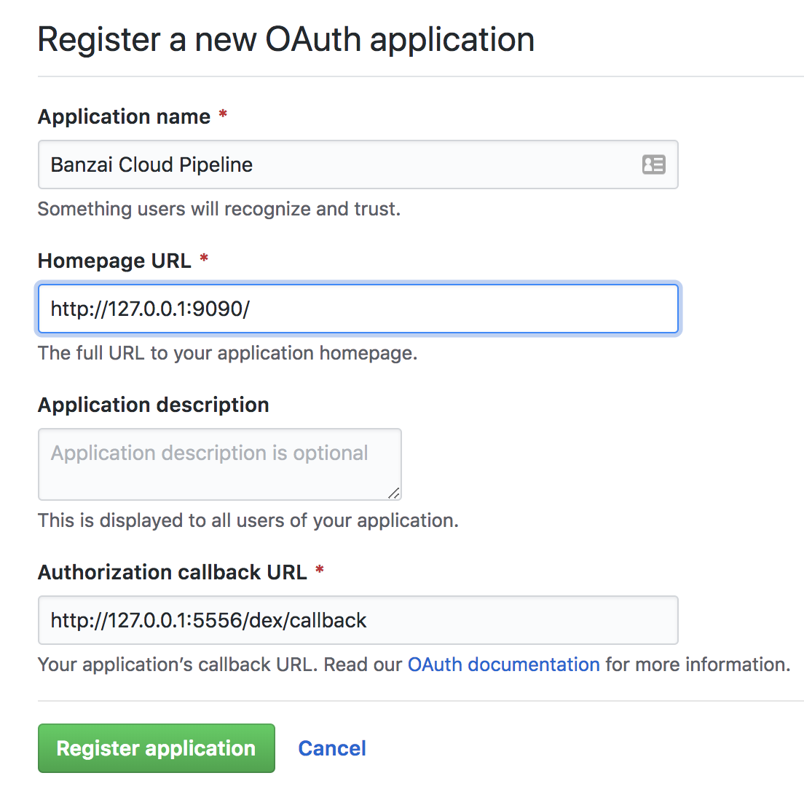
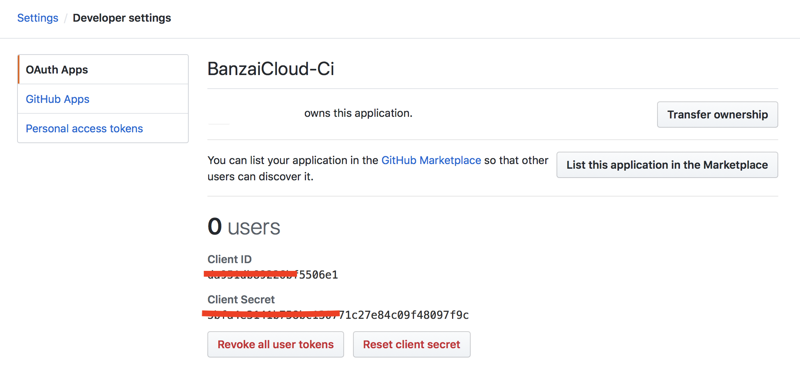

## GitHub OAuth App setup

### Create a personal access token on GitHub

Create a [personal access token](https://help.github.com/articles/creating-a-personal-access-token-for-the-command-line/) on GitHub.

Take note of the generated GitHub access token as it will be needed.

### Register the OAuth application on GitHub

Register an [OAuth](https://developer.github.com/apps/building-integrations/setting-up-and-registering-oauth-apps/registering-oauth-apps/) application on GitHub for the Pipeline API and CI/CD workflow.



Fill in `Authorization callback URL`. This field has to be updated once the Control Plane is up and running using the IP address or the DNS name:

- For local usage:
    ```bash
    http://127.0.0.1:5556/dex/callback
    ```

- For on-cloud usage:
    ```bash
    http://{control_plane_public_address}/dex/callback
    ```

Take note of the `Client ID` and `Client Secret` as these will be required for launching the Pipeline Control Plane and fill them into the `etc/config/dex.yml` file (or into environment variables, see that file for details).


