Starting from the [0.2.0](https://github.com/banzaicloud/pipeline/tree/0.2.0) version Pipeline supports managed Kubernetes clusters on Azure [AKS](https://docs.microsoft.com/en-us/azure/aks/) as well.

### Getting Started

The [Pipeline Control Plane](https://github.com/banzaicloud/pipeline-cp-launcher/tree/0.2.0) takes care of creating a Kubernetes cluster on the desired cloud provider and can be hosted on both `AWS` and `Azure`.

### Prerequisites of hosting the control plane on AWS

Hosting `Pipeline Control Plane` and creating Kubernetes clusters on **`AWS`**

   1. [AWS](https://portal.aws.amazon.com/billing/signup?type=enterprise#/start) account
   1. AWS [EC2 key pair](http://docs.aws.amazon.com/AWSEC2/latest/UserGuide/ec2-key-pairs.html)

### Prerequisites of hosting the control plane on Azure

Hosting `Pipeline Control Plane` and creating Kubernetes clusters on **`Azure`**

   1. [Azure](https://portal.azure.com) subscription with AKS service enabled.
   1. Obtain a Client Id, Client Secret and Tenant Id for a Microsoft Azure Active Directory. These information can be retrieved from the portal, but the easiest and fastest way is to use the Azure CLI tool.<br>  

```bash
$ curl -L https://aka.ms/InstallAzureCli | bash
$ exec -l $SHELL
$ az login
```

You should get something like:

```json
{

  "appId": "1234567-1234-1234-1234-1234567890ab",
  "displayName": "azure-cli-2017-08-18-19-25-59",
  "name": "http://azure-cli-2017-08-18-19-25-59",
  "password": "1234567-1234-1234-be18-1234567890ab",
  "tenant": "7654321-1234-1234-ee18-9876543210ab"
}
```

* `appId` is the Azure Client Id
* `password` is the Azure Client Secret
* `tenant` is the Azure Tenant Id

In order to get Azure Subscription Id run:

```sh
az account show --query id
```

### Launch Pipeline Control Plane on `AWS`

The easiest way for running a Pipeline Control Plane is to use a [Cloudformation](https://aws.amazon.com/cloudformation/) template.

* Navigate to: https://eu-west-1.console.aws.amazon.com/cloudformation/home?region=eu-west-1#/stacks/new

* Select `Specify an Amazon S3 template URL` and add the URL to our template `https://s3-eu-west-1.amazonaws.com/cf-templates-grr4ysncvcdl-eu-west-1/2018026em9-new.templatee93ate9mob7`

  <a href="images/howto/ControlPlaneFromTemplate.png" target="_blank">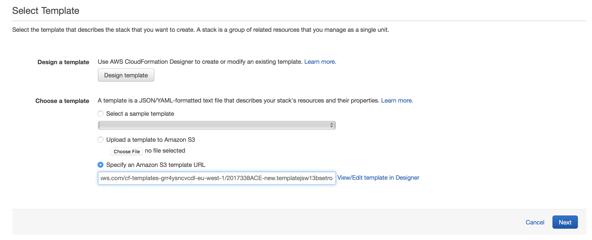</a>

* Fill in the following fields on the form:

  * **Stack name**
    * specify a name for the Control Plane deployment

      <a href="images/howto/StackName.png"></a>

  * **AWS Credentials**
     * Amazon access key id - specify your [access key id](http://docs.aws.amazon.com/general/latest/gr/aws-sec-cred-types.html#access-keys-and-secret-access-keys)
     * Amazon secret access key - specify your [secret access key](http://docs.aws.amazon.com/general/latest/gr/aws-sec-cred-types.html#access-keys-and-secret-access-keys)

     <a href="images/howto/AwsCred.png">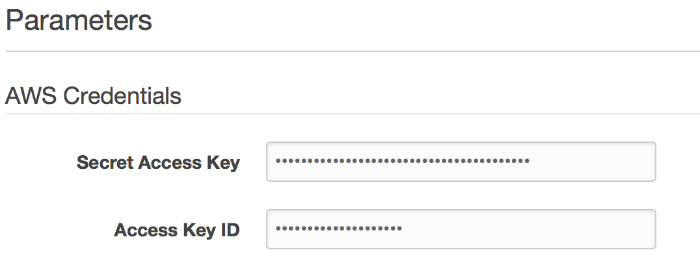</a>

  * **Azure Credentials and Information** - _needed only for creating Kubernetes clusters on `Azure`_
     * AzureClientId - see how to get Azure Client Id above
     * AzureClientSecret - see how to get Azure Client Secret above
     * AzureSubscriptionId - your Azure Subscription Id
     * AzureTenantId - see how to get Azure Client Tenant Id above

     <a href="images/howto/AzureCred.png">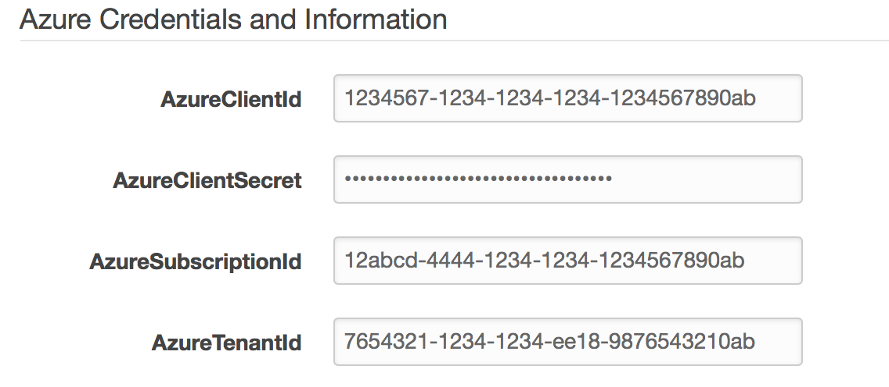</a>

  * **Control Plane Instance Config**
     * InstanceName - name of the EC2 instance that will host the Control Plane
     * ImageId - pick the image id from the  [README](https://github.com/banzaicloud/pipeline-cp-launcher/blob/0.2.0/README.md)
     * KeyName - specify your AWS [EC2 key pair](http://docs.aws.amazon.com/AWSEC2/latest/UserGuide/ec2-key-pairs.html)

     <a href="images/howto/ControlPlaneInstanceConfig.png">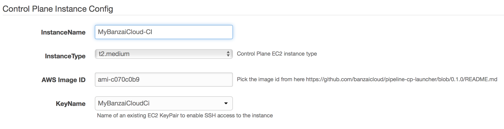</a>

  * **Banzai-Ci Credentials**
     * Orgs - comma-separated list of Github organizations whose members to grant access to use Banzai Cloud Pipeline's CI/CD workflow
     * Github Client - GitHub OAuth `Client Id`
     * Github Secret - Github OAuth `Client Secret`

      <a href="images/howto/CloudFormulationDetails3.png">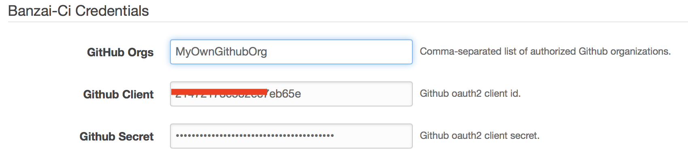</a>

  * **Grafana Dashboard**
     * Grafana Dashboard Password - specify password for accessing Grafana dashboard with defaults specific to the application

     <a href="images/howto/GrafanaCred.png">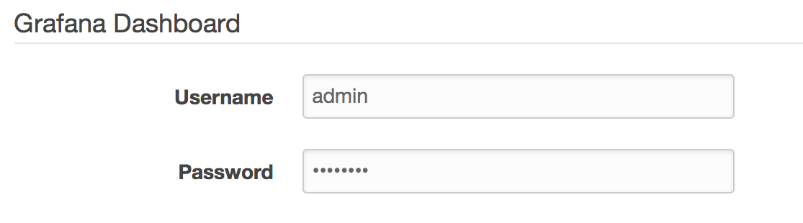</a>

  * **Prometheus Dashboard**
     * Prometheus Password - specify password for accessing Prometheus that collects cluster metrics

      <a href="images/howto/PrometheusCred.png">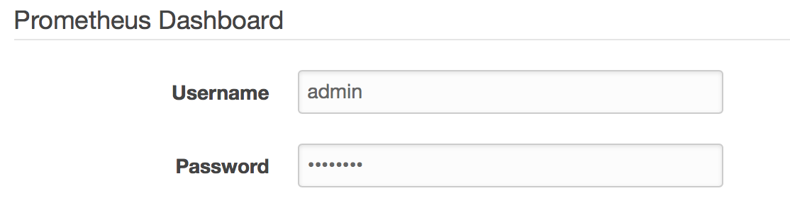</a>

  * **Advanced Pipeline Options**
     * PipelineImageTag - specify `0.2.0` for using current stable Pipeline release.

     <a href="images/howto/AdvencedPipOpt.png">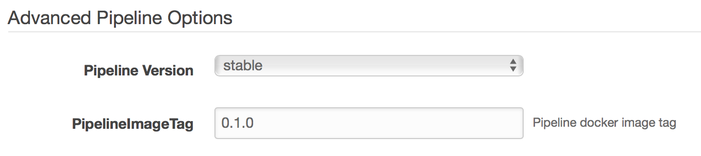</a>

  * **Slack Credentials**
       * this section is optional. Complete this section to receive  cluster related alerts through a [Slack](https://slack.com) push notification channel.

  * **Alert SMTP Credentials**
     * this section is optional. Fill this section to receive cluster related alerts through email.

* Finish the wizard to create a `Control Plane` instance.
* Take note of the PublicIP of the created Stack. We refer to this as the PublicIP of `Control Plane`.

    <a href="images/howto/CloudFormulationDetails5.png">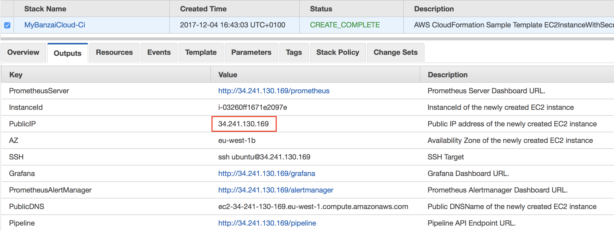</a>

* Go back to the earlier created GitHub OAuth application and modify it. Set the `Authorization callback URL` field to `http://{control_plane_public_ip}/authorize`

  <a href="images/howto/OAuthCallback.png">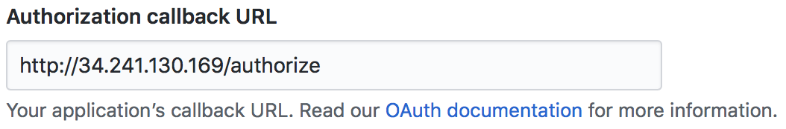</a>

### Launch Pipeline Control Plane on `Azure`

The easiest way for running a Pipeline Control Plane is deploying it using an [ARM](https://docs.microsoft.com/en-us/azure/azure-resource-manager/resource-group-overview) template.

* Navigate to: https://portal.azure.com/#create/Microsoft.Template

* Click `Build your own template in editor` and copy-paste the content of [ARM template](https://raw.githubusercontent.com/banzaicloud/pipeline-cp-launcher/0.2.0/control-plane-arm.json) into the editor then click `Save`

  <a href="images/howto/ARMCreate.png" target="_blank">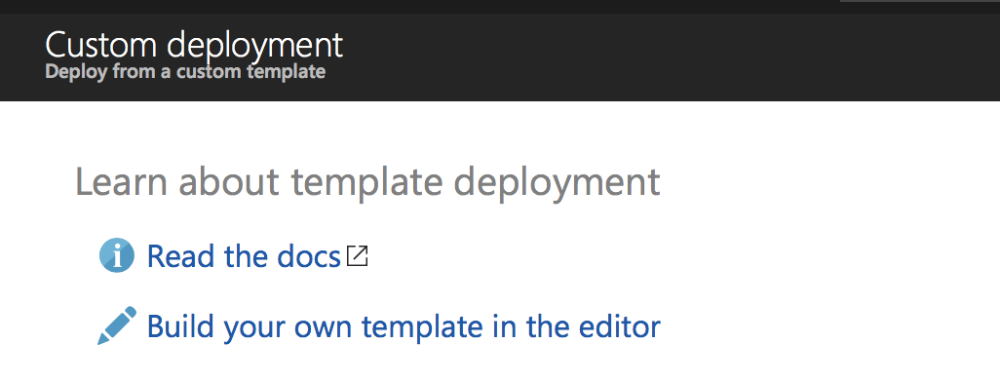</a><br>
  <a href="images/howto/ARMEditor.png" target="_blank">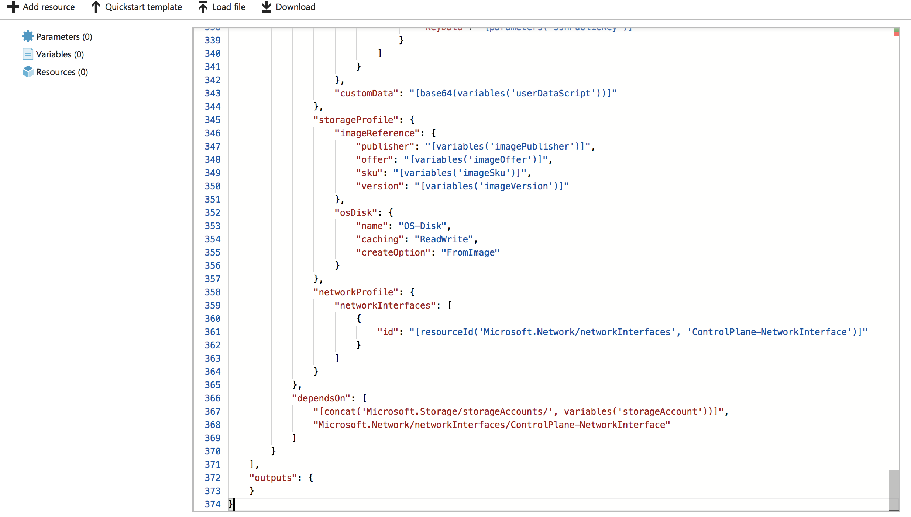</a>

  * **Resource group** - We recommend creating a new `Resource Group` for the deployment as later will be easier to clean up all the resources created by the deployment

    <a href="images/howto/ARMRGroup.png" target="_blank">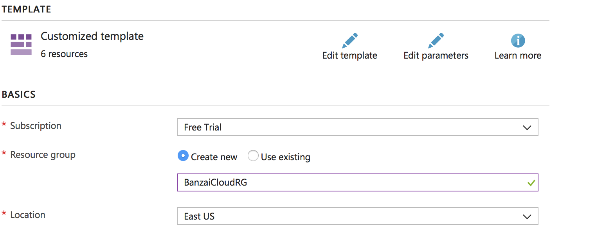</a>

  * **Specify SSH Public Key**

    <a href="images/howto/ARMPubKey.png" target="_blank">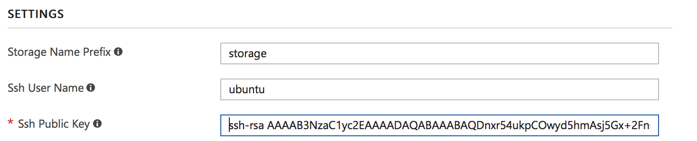</a>

  * **SMTP Server Address/User/Password/From**
    * these are optional. Fill this section to receive cluster related alerts through email.

  * **Slack Webhook Url/Channel**
    * this section is optional. Complete this section to receive  cluster related alerts through a [Slack](https://slack.com) push notification channel.

  * **Banzai Pipeline Credentials**
     * Pipeline Password - specify the password for accessing the Pipeline REST [API](https://github.com/banzaicloud/pipeline/blob/0.2.0/docs/create.md) exposed by the Pipeline PaaS. **_Take note of the user name and password as those will be required when setting the [secrets](#repository-secrets) for the GitHub repositories in the CI/CD workflow._**

      <a href="images/howto/ARMPiCred.png">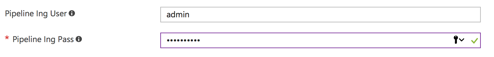</a>

   * **Prometheus Dashboard**
     * Prometheus Password - specify password for accessing Prometheus that collects cluster metrics

      <a href="images/howto/ARMPrometheusCred.png">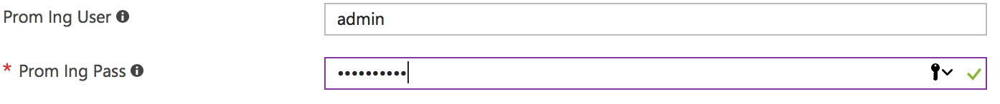</a>

  * **Grafana Dashboard**
     * Grafana Dashboard Password - specify password for accessing Grafana dashboard with defaults specific to the application

     <a href="images/howto/ARMGrafanaCred.png">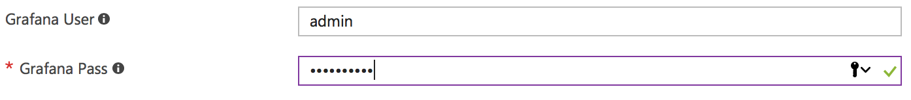</a>

  * **Banzai-Ci Credentials**
     * Orgs - comma-separated list of Github organizations whose members to grant access to use Banzai Cloud Pipeline's CI/CD workflow
     * Github Client - GitHub OAuth `Client Id`
     * Github Secret - Github OAuth `Client Secret`

      <a href="images/howto/ARMCICD.png"></a>

  * **Azure Credentials and Information**
     * Azure Client Id - see how to get Azure Client Id above
     * Azure Client Secret - see how to get Azure Client Secret above
     * Azure Subscription Id - your Azure Subscription Id
     * Azure Tenant Id - see how to get Azure Tenant Id above

     <a href="images/howto/images/howto/ARMAzureCreds.png">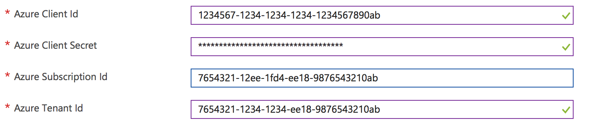</a>

  * Finish the wizard to create a `Control Plane` instance.
  * Open the `Resource Group` that was specified for the deployment

      <a href="images/howto/CPRGroup.png">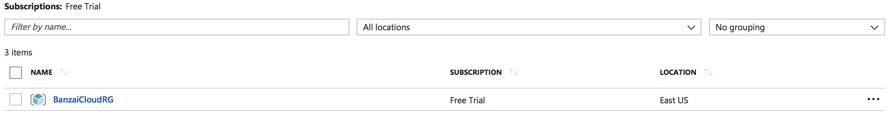</a>

  * Take note of the PublicIP of the deployed `Control Plane`.

    <a href="images/howto/AzureCPPubIP.png">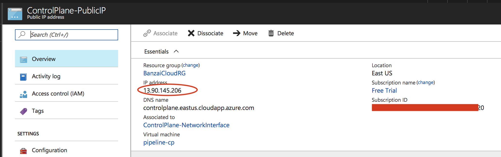</a>
