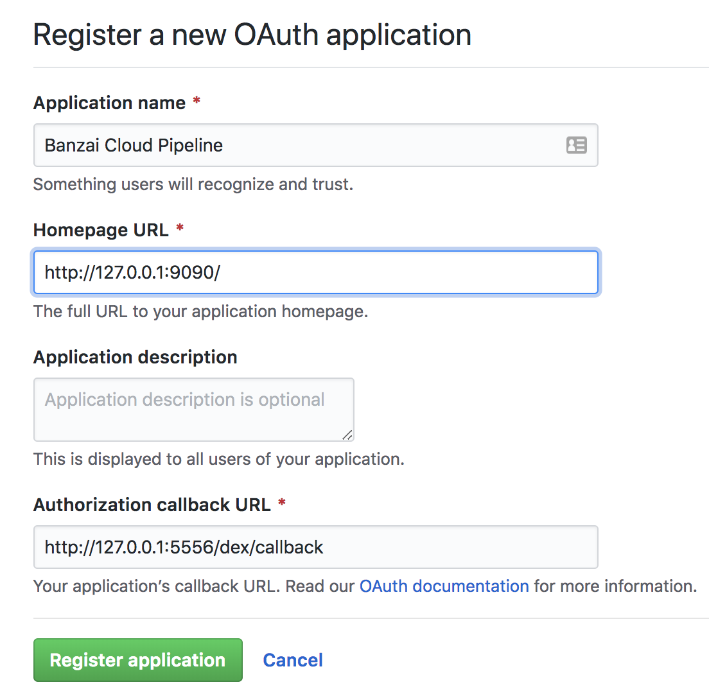

## GitHub OAuth App setup

### Create a personal access token on GitHub

Create a [personal access token](https://help.github.com/articles/creating-a-personal-access-token-for-the-command-line/) on GitHub.

Take note of the generated GitHub access token as it will be needed.

### Register the OAuth application on GitHub

Register an [OAuth](https://developer.github.com/apps/building-integrations/setting-up-and-registering-oauth-apps/registering-oauth-apps/) application on GitHub for the Pipeline API and CI/CD workflow.

<a href="images/howto/OAuthAppReg.png" target="_blank"></a>

Fill in `Authorization callback URL`. This field has to be updated once the Control Plane is up and running using the IP address or the DNS name:

- For local usage:
    ```bash
    http://127.0.0.1:5556/dex/callback
    ```

- For on-cloud usage:
    ```bash
    http://{control_plane_public_address}/dex/callback
    ```

Take note of the `Client ID` and `Client Secret` as these will be required for launching the Pipeline Control Plane.

<a href="images/howto/OAuthAppId.png" target="_blank"></a>


### Acquiring the access token

For accessing the Pipeline one has to be authenticated via GitHub. For programmatic API access an access token has to be generated.

Tokens can be generated only with a browser (for now), to do that please use the following URL:

- For local usage:
    ```bash
    http://localhost:9090/auth/dex/login
    ```

- For on-cloud usage:
    ```bash
    http://{control_plane_public_ip}/auth/dex/login
    ```

Please authenticate yourself with GitHub. If everything is done correctly you will be redirected.
The browser already contains the generated token. It can be retrieved by issuing the following:

- For local usage:
    ```bash
    http://localhost:9090/pipeline/api/v1/token
    ```

- For on-cloud usage:
    ```bash
    http://{control_plane_public_ip}/pipeline/api/v1/token
    ```
