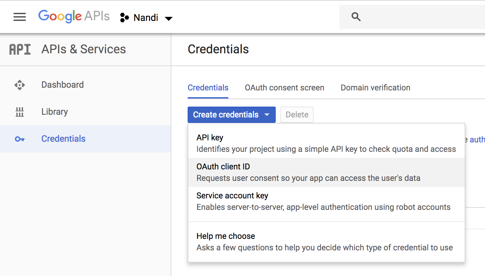
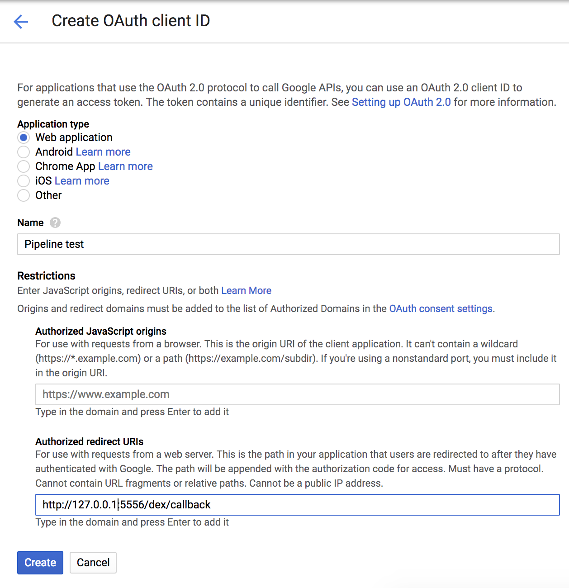
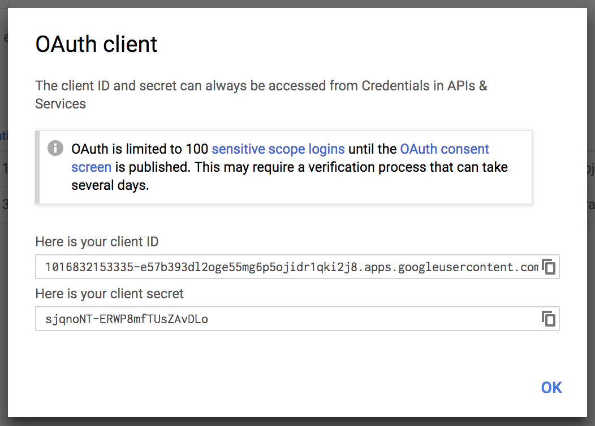

## Google OAuth App setup

### Register the OAuth application on Google Developer Console

Register an [OAuth](https://console.developers.google.com/apis/credentials) client ID for the Pipeline API and CI/CD workflow.

<a href="images/howto/GoogleOAuthAppReg.png" target="_blank"></a>

Fill in `Authorized redirect URI`. This field has to be updated once the Control Plane is up and running using the IP address or the DNS name:

- For local usage:
    ```bash
    http://127.0.0.1:5556/dex/callback
    ```

- For on-cloud usage:
    ```bash
    http://{control_plane_public_address}/dex/callback
    ```

<a href="images/howto/GoogleOAuthAppId.png" target="_blank"></a>


Take note of the `Client ID` and `Client Secret` as these will be required for launching the Pipeline Control Plane and fill them into the `config/dex.yml` file (or into environment variables, see that file for details).

<a href="images/howto/GoogleOAuthClientId.png" target="_blank"></a>
