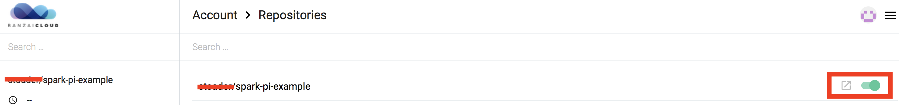
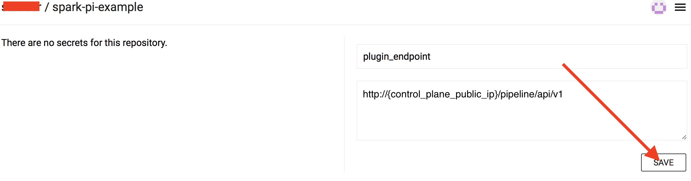
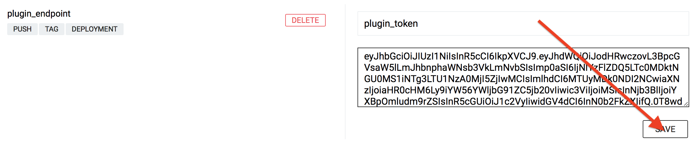
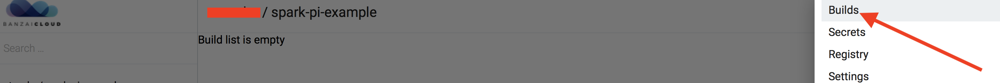
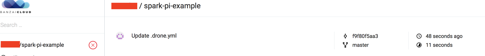
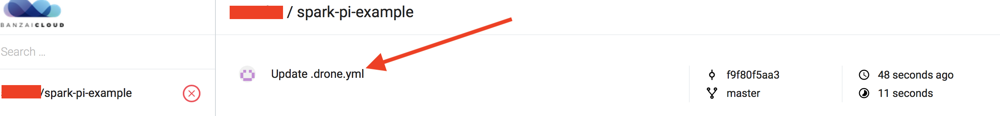
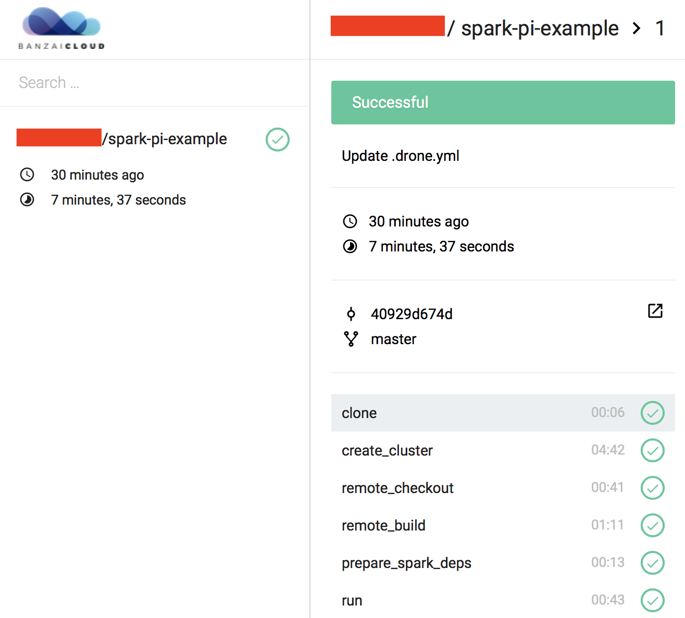

Starting from the [0.3.0](https://github.com/banzaicloud/pipeline/tree/0.3.0) version Pipeline supports managed Kubernetes clusters on Google Cloud [GKE](https://cloud.google.com/kubernetes-engine/) as well.

Another change introduced in `0.3.0` is that Pipeline requires GitHub OAuth authentication similar to the CICD flow. With that we have a single mechanism to authenticate both Pipeline and CI/CD flow instead of what it was before where Pipeline required basic authentication while the CICD flow GitHub OAuth authentication.

For simplicity the instruction steps are presented through an example specifically how to hook a Spark application into a CI/CD workflow to run it on managed Kubernetes on Google Cloud (GKE).

### Getting Started

It's assumed that the source of the Spark application is stored in [GitHub](http://github.com).

The [Pipeline Control Plane](https://github.com/banzaicloud/pipeline-cp-launcher/tree/0.3.0) takes care of creating a Kubernetes cluster and executing the steps of the CI/CD flow on one of the supported cloud provider (AWS, Azure, Google Cloud).

To hook your Spark application into BanzaiCloud CI/CD flow the following steps are required:

1. [Register the OAuth application on GitHub](#Register-the-OAuth-application-on-GitHub)

1. [Deploy Control Plane](#Deploy-Control-Plane)

1. [Define CI/CD workflow configuration for your Spark application](#Define-pipeline-workflow-configuration-for-your-Spark-application)

1. [Grant access to desired GitHub organizations](#Grant-access-to-desired-GitHub-organizations)

1. [Hook GitHub repositories to CI/CD flow](#Hook-repositories-to-CI/CD-flow)

1. [Trigger the CICD workflow](#Trigger-the-CICD-workflow)

1. [Monitor running workflows](#Monitor-running-workflows)

### Register the OAuth application on GitHub

Both Pipeline and CICD flow requires GitHub OAuth authentication and for this a OAuth application must be setup on GitHub.

Setup your Pipeline GitHub OAuth application according to [this guilde](./github-app.md)

### Deploy Control Plane

Deploy `Control Plane` using [Pipeline Control Plane Launcher](https://github.com/banzaicloud/pipeline-cp-launcher/tree/0.3.0) to the one of the supported cloud providers where you would like to run your CI/CD flow.

* Take note of the PublicIP of the host where `Control Plane` was deployed. We refer to this as the PublicIP of `Control Plane`:
  * [AWS](https://github.com/banzaicloud/pipeline-cp-launcher/blob/0.3.0/docs/control-plane-on-aw)
  * [Azure](https://github.com/banzaicloud/pipeline-cp-launcher/blob/0.3.0/docs/control-plane-on-azure.md#deployment-end-points)
  * [Google Cloud](https://github.com/banzaicloud/pipeline-cp-launcher/blob/0.3.0/docs/control-plane-on-gcloud.md#deployment-end-points)

* Go back to the earlier created GitHub OAuth application and modify it. Set the `Authorization callback URL` field according to [OAuth Application Authorization Callback](./github-app.md#register-the-oauth-application-on-github)

### Define pipeline workflow configuration for your Spark application

The steps of the workflow executed by the CI/CD flow are described in the  `.pipeline.yml` file that must be placed under the root directory of the source code of the Spark application. The file has to be pushed into the GitHub repo along with the source files of the application.

There is an example Spark application [spark-pi-example](https://github.com/banzaicloud/spark-pi-example/tree/0.3.0) that can be used for trying out the CI/CD pipeline.

>Note: Fork this repository into your own repository for this purpose!.

For setting up your own spark application for the workflow you can start from one of the `.pipeline.yml` configuration file templates from `spark-pi-example` and customize it. Notice that there are separate templates for the different cloud providers. Pick the one that corresponds for the cloud provider you're using and create your `.pipeline.yml` from it.

The following sections may need to be customized:

- the cluster where your application executed

  ```yaml
  create_cluster:
    ...
    cluster_name: "[[your-cluster-name]]"
  ```

- the command for building your application

  ```yaml
  remote_build:
    ...
    original_commands:
      - mvn clean package
  ```

- the Main class of your application

  ```yaml
  run:
    ...
    spark_submit_options:
    ...
      class: banzaicloud.SparkPi
  ```

- the name of your spark application

  ```yaml
  run:
    ...
    spark_submit_configs:
    ...
      spark.app.name: sparkpi
  ```

- the application artifact

  This is the relative path to the `jar` of your Spark application. This is the `jar` generated by the [build command](#the-command-for-building-your-application)

  ```yaml
  run:
    ...
    spark_submit_app_args:
      - target/spark-pi-1.0-SNAPSHOT.jar
  ```

- the application arguments

  ```yaml
  run:
    ...
    spark_submit_app_args:
      - 1000
  ```

### Grant access to desired GitHub organizations

Navigate to `http://{control_plane_public_ip}/auth/github/login` in your web browser and grant access for the organizations that contain the GitHub repositories that you want to hook into the CI/CD workflow. Then click authorize access.

If the login and authorization succeeds the user is redirected to the CI/CD UI.

All the services of the Pipeline may take some time to fully initialize, thus the page may not load at first. Please give it some time and retry.

### Hook repositories to CI/CD flow

Navigate to `http://{control_plane_public_ip}/`  - this will bring you to the CI/CD user interface. Select `Repositories` from top left menu. This will list all the repositories that the Pipeline has access to.
Select repositories desired to be hooked to the CI/CD flow.

<a href="images/howto/EnableRepoCI.png" target="_blank"></a>

### CI/CD secrets

For the hooked repositories set the following secrets :

<a href="images/howto/RepoSecretCI.png" target="_blank"></a>
<a href="images/howto/RepoSecretMenuCI.png" target="_blank"></a>

* `plugin_endpoint` - specify `http://{control_plane_public_ip}/pipeline/api/v1`

  <a href="images/howto/RepoSecretPluginEndPointCI.png" target="_blank"></a>

* `plugin_token` - this is the token needed to access the Pipeline API. To obtain this token see [how to acquire the access token](./github-app.md#acquiring-the-access-token)

  <a href="images/howto/RepoSecretPluginToken.png" target="_blank"></a>

### Trigger the CICD workflow

Modify the source code of your Spark application, commit the changes and push it to the repository on GitHub. The Pipeline gets notified through GitHub webhooks about the commits and will trigger the flow described in the `.pipeline.yml` file of the watched repositories.

### Monitor running workflows

The running CI/CD jobs can be monitored and managed at `http://{control_plane_public_ip}/account/repos`

<a href="images/howto/BuildMenuCI.png" target="_blank"></a>

<a href="images/howto/JobCI.png" target="_blank"></a>

In order to check the logs of the CI/CD workflow steps, click on the desired commit message on the UI.

<a href="images/howto/JobCIBuild.png"></a>
<br>
<a href="images/howto/SparkPiSuccess.png"></a>

Once configured the Spark application will be built, deployed and executed for every commit pushed to the project's repository. The progress of the workflow can be followed by clicking on the small orange dot beside the commit on the GitHub UI.

Our git repos with example projects that contain pipeline workflow configurations:

- [Spark PDI Example](https://github.com/banzaicloud/spark-pdi-example/tree/0.3.0)
- [Zeppelin PDI Example](https://github.com/banzaicloud/zeppelin-pdi-example/tree/0.3.0)
- [Spark Pi Example](https://github.com/banzaicloud/spark-pi-example/tree/0.3.0)
