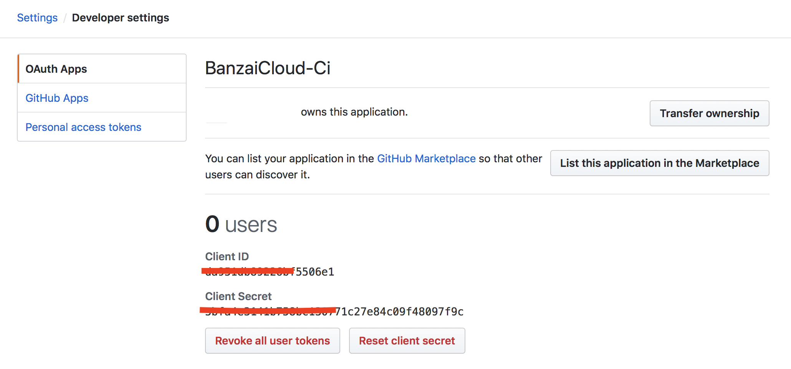

To hook a Spark project into the CI/CD workflow of Banzai Cloud [Pipeline](https://github.com/banzaicloud/pipeline/tree/0.1.0) follow the instructions below

### Getting Started

It's assumed that the source of the Spark application is stored in [GitHub](http://github.com) and the user has an [AWS](https://portal.aws.amazon.com/billing/signup?type=enterprise#/start) account as the example CI flow runs on EC2 instances provisioned on demand. Nevertheless [Pipeline](https://github.com/banzaicloud/pipeline/tree/0.1.0) is not tied to a particular cloud provider, it supports a variety of them and managed K8S providers as well (see the Pipeline documentation).

### Prerequisites

1. Account on [GitHub](http://github.com)
1. Repository on [GitHub](http://github.com) for the Spark application source code
1. [AWS](https://portal.aws.amazon.com/billing/signup?type=enterprise#/start) account
1. AWS [EC2 key pair](http://docs.aws.amazon.com/AWSEC2/latest/UserGuide/ec2-key-pairs.html)

### Register the OAuth application on GitHub

Register an [OAuth](https://developer.github.com/apps/building-integrations/setting-up-and-registering-oauth-apps/registering-oauth-apps/) application on GitHub for the Pipeline CI/CD workflow.

<a href="images/howto/OAuthAppReg.png" target="_blank"></a>

Fill in `Authorization callback URL` with some dummy value at this stage. This field will be updated once the Control Plane is up and running using the IP address or the DNS name.

Take note of the `Client ID` and `Client Secret` as these will be required for launching the Pipeline Control Plane.

<a href="images/howto/OAuthAppId.png" target="_blank"></a>

### Launch Pipeline Control Plane

The easiest way for running a Pipeline Control Plane is to use a [Cloudformation](https://aws.amazon.com/cloudformation/) template.

* Navigate to: https://eu-west-1.console.aws.amazon.com/cloudformation/home?region=eu-west-1#/stacks/new

* Select `Specify an Amazon S3 template URL` and add the URL to our template `https://s3-eu-west-1.amazonaws.com/cf-templates-grr4ysncvcdl-eu-west-1/2017340oCy-new.templatei5xlidcwt4p`

  <a href="images/howto/ControlPlaneFromTemplate.png" target="_blank"></a>

* Fill in the following fields on the form:

  * **Stack name**
    * specify a name for the Control Plane deployment

      <a href="images/howto/StackName.png"></a>

  * **AWS Credentials**
     * Amazon access key id - specify your [access key id](http://docs.aws.amazon.com/general/latest/gr/aws-sec-cred-types.html#access-keys-and-secret-access-keys)
     * Amazon secret access key - specify your [secret access key](http://docs.aws.amazon.com/general/latest/gr/aws-sec-cred-types.html#access-keys-and-secret-access-keys)

     <a href="images/howto/AwsCred.png"></a>

  * **Control Plane Instance Config**
     * InstanceName - name of the EC2 instance that will host the Control Plane
     * ImageId - pick the image id from the  [README](https://github.com/banzaicloud/pipeline-cp-launcher/blob/0.1.0/README.md)
     * KeyName - specify your AWS [EC2 key pair](http://docs.aws.amazon.com/AWSEC2/latest/UserGuide/ec2-key-pairs.html)

     <a href="images/howto/ControlPlaneInstanceConfig.png"></a>

  * **Banzai Pipeline Credentials**
     * Pipeline API Password - specify the password for accessing the Pipeline REST [API](https://github.com/banzaicloud/pipeline/blob/0.1.0/docs/create.md) exposed by the Pipeline PaaS. **_Take note of the user name and password as those will be required when setting the [secrets](#repository-secrets) for the GitHub repositories in the CI/CD workflow._**

      <a href="images/howto/PipelineCred.png"></a>

  * **Banzai-Ci Credentials**
     * Orgs - comma-separated list of Github organizations whose members to grant access to use Banzai Cloud Pipeline's CI/CD workflow
     * GithubClient - GitHub OAuth `Client Id`
     * GithubSecret - Github OAuth `Client Secret`

      <a href="images/howto/CloudFormulationDetails3.png"></a>

  * **Grafana Dashboard**
     * Grafana Dashboard Password - specify password for accessing Grafana dashboard with defaults specific to the application

     <a href="images/howto/GrafanaCred.png"></a>

  * **Prometheus Dashboard**
     * Prometheus Password - specify password for accessing Prometheus that collects cluster metrics

      <a href="images/howto/PrometheusCred.png"></a>

  * **Advanced Pipeline Options**
     * PipelineImageTag - specify `0.1.0` for using current stable Pipeline release.

     <a href="images/howto/AdvencedPipOpt.png"></a>

  * **Slack Credentials**
       * this section is optional. Complete this section to receive  cluster related alerts through a [Slack](https://slack.com) push notification channel.

  * **Alert SMTP Credentials**
     * this section is optional. Fill this section to receive cluster related alerts through email.

* Finish the wizard to create a `Control Plane` instance.
* Take note of the PublicIP of the created Stack. We refer to this as the PublicIP of `Control Plane`.

    <a href="images/howto/CloudFormulationDetails5.png"></a>

* Go back to the earlier created GitHub OAuth application and modify it. Set the `Authorization callback URL` field to `http://{control_plane_public_ip}/authorize`

  <a href="images/howto/OAuthCallback.png"></a>


### Define `.pipeline.yml` pipeline workflow configuration for your Spark application

The steps of the workflow executed by the CI/CD flow are described in the  `.pipeline.yml` file that must be placed under the root directory of the source code of the Spark application. The file has to be pushed into the GitHub repo along with the source files of the application.

There is an example Spark application [spark-pi-example](https://github.com/banzaicloud/spark-pi-example) that can be used for trying out the CI/CD pipeline.

>Note: Fork this repository into your own repository for this purpose!).

For setting up your own spark application for the workflow you can start from the `.pipeline.yml` configuration file from `spark-pi-example` and customize it.

The following sections needs to be modified:

- the command for building your application

  ```yaml
  remote_build:
    ...
    original_commands:
      - mvn clean package -s settings.xml
  ```

- the Main class of your application

  ```yaml
  run:
    ...
    spark_class: banzaicloud.SparkPi
  ```

- the name of your application

  ```yaml
  run:
    ...
    spark_app_name: sparkpi
  ```

- the application artifact

  This is the relative path to the `jar` of your Spark application. This is the `jar` generated by the [build command](#command-for-building-your-application)

  ```yaml
  run:
    ...
    spark_app_source: target/spark-pi-1.0-SNAPSHOT.jar
  ```

-  the application arguments

  ```yaml
  run:
    ...
    spark_app_args: 1000
  ```

### Grant access to desired GitHub organizations

Navigate to `http://{control_plane_public_ip}` in your web browser and grant access for the organizations that contain the GitHub repositories that you want to hook into the CI/CD workflow. Then click authorize access.

All the services of the Pipeline may take some time to fully initialize, thus the page may not load at first. Please give it some time and retry.

### Hook repositories to CI/CD flow

Navigate to `http://{control_plane_public_ip}`  - this will bring you to the CI/CD user interface. Select `Repositories` from top left menu. This will list all the repositories that the Pipeline has access to.
Select repositories desired to be hooked to the CI/CD flow.

<a href="images/howto/EnableRepoCI.png" target="_blank"></a>

### CI/CD secrets

For the hooked repositories set the following secrets :

<a href="images/howto/RepoSecretCI.png" target="_blank"></a>
<a href="images/howto/RepoSecretMenuCI.png" target="_blank"></a>

* `plugin_endpoint` - specify `http://{control_plane_public_ip}/pipeline/api/v1`

  <a href="images/howto/RepoSecretPluginEndPointCI.png" target="_blank"></a>

* `plugin_username` - specify the same user name as for **Banzai Pipeline Credentials**

  <a href="images/howto/RepoSecretPluginUserNameCI.png" target="_blank"></a>

* `plugin_password` - specify the same password as for **Banzai Pipeline Credentials**

  <a href="images/howto/RepoSecretPluginPasswordCI.png" target="_blank"></a>

### Submit your changes

Modify the source code of your Spark application, commit the changes and push it to the repository on GitHub. The Pipeline gets notified through GitHub webhooks about the commits and will trigger the flow described in the `.pipeline.yml` file of the watched repositories.

### Monitor running workflows

The running CI/CD jobs can be monitored and managed at `http://{control_plane_public_ip}/account/repos`


<a href="images/howto/BuildMenuCI.png" target="_blank"></a>

<a href="images/howto/JobCI.png" target="_blank"></a>

In order to check the logs of the CI/CD workflow steps, click on the desired commit message on the UI.

<a href="images/howto/JobCIBuild.png"></a>
<br>
<a href="images/howto/SparkPiSuccess.png"></a>

That's all!
Once configured the Spark application will be built, deployed and executed for every commit pushed to the project's repository. The progress of the workflow can be followed by clicking on the small orange dot beside the commit on the GitHub UI.

Our git repos with example projects that contain pipeline workflow configurations:

- [Spark PDI Example](https://github.com/banzaicloud/spark-pdi-example/tree/0.1.0)
- [Zeppelin PDI Example](https://github.com/banzaicloud/zeppelin-pdi-example/tree/0.1.0)
- [Spark Pi Example](https://github.com/banzaicloud/spark-pi-example/tree/0.1.0)
