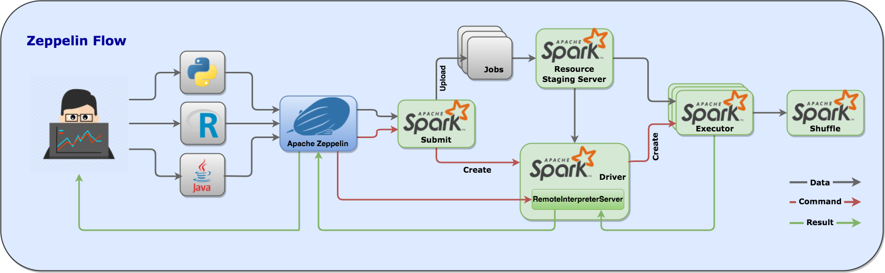

### Spotguide specification

#### Apache Spark

One of the default spotguides is for Apache Spark. There are many examples on how to run Spark on Kubernetes/cloud, however they are all running in standalone or YARN mode. Neither of these is really efective, Spark on YARN on Kubernetes is using multiple resource managers that doesn't have any knowledge about each other. Pipeline's spotguide understands the Spark job and the Apache Spark [internals](https://github.com/apache-spark-on-k8s/spark) as well - all the Spark components are deployed in containers, scheduled by the Kubernetes scheduler and can be (auto)scaled vertically or horizontally.

A typical example of a Spark flow looks like this:

#### Apache Zeppelin

The Apache Zeppelin spotguide picks up a change in a Spark notebook and deploys and executes it on Kubernetes/cloud in cluster mode. This is built on top of the Spark spotguide - the Spark Driver runs inside the Kubernetes cluster. Zeppelin uses spark-submit to start `RemoteInterpreterServer` which is able to execute notebooks on Spark. 

A typical example of a Zeppelin flow looks like this:

#### Apache Kafka 

The Apache Kafka `spotguide` has a good understanding of consumers and producers but more importantly it monitors, scales, rebalances and auto-heals the Kafka cluster. It autodetects broker failures, reassigns workloads and edits partition reassignment files.

_Note: Kafka on Kubernetes does not use Zookeper at all. For all quotas, controller election, cluster membership and configuration it is using **etcd**, a faster and more reliable `cloud-native` distributed system for coordination and metadata storage._
