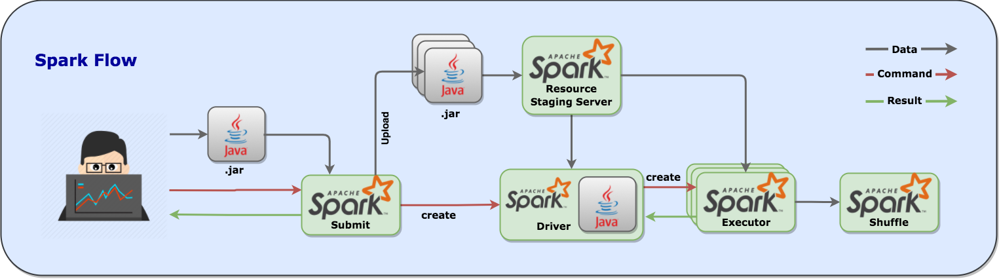

### Spotguide specification

For Pipeline a `spotguide` is a combination of a few yaml files that describe an application, specify the deployment environment, contain the SLA rules for resilience, autoscaling and failover scenarios, and  describe a runtime analyzer/monitor. `Spotguides` typically examine the application to determine the dependencies and have an understanding of how to build and deploy it. All the Kubernetes and cloud infrastructure related services are configured out of the box - e.g if a service needs ingress (based on the protocol and the application/deployment type) than the `spotguide` downloads, installs, starts and registers those service (e.g. Traefik, AWS ELB, etc).

When you push a code change to GitHub, the Pipeline platform automatically detects the appropriate `spotguide`, reads the descriptors and initiates the pipeline.

#### Big data

Pipeline PaaS allows enterprises to shift from a host-centric infrastructure to one that is container and application centric and take advantage of containers’ portability and flexibility. Today's big data frameworks require a scheduler (Apache YARN) and a distributed coordination framework (Apache Zookeeper) however better alternatives are already key building blocks of Kubernetes. Running big data workloads on the Pipeline PaaS removes all the requirements to use, install and maintain these systems and provide a cloud native way to run, schedule and scale the workload. The Kubernetes scheduler is aware of the application state and understands the infrastructure and cluster as well. A better density, utilization, broader range of workloads and varying latency  are all among the benefits.

#### Apache Spark

One of the default `spotguides` describes an Apache Spark deployment. For further information about the Apache Spark `spotguide` please follow this [guide](docs/spotguides.md).
A typical example of a Spark flow is this.

_Note: Spark on Kubernetes does not use YARN, all scheduling and resource management is natively and more efficiently done by the Kuberneres scheduler._

#### Apache Zeppelin

The Apache Zeppelin `spotguide` picks up a change in a Spark notebook and deploys and executes it on Kubernetes in cluster mode. For further information about the Apache Zeppelin `spotguide` please follow this [guide](docs/spotguides.md)
A typical example of a Zeppelin flow is this.

_Note: Zeppelin on Kubernetes for Spark notebooks does not use YARN, all scheduling and resource management is natively and more efficiently done by the Kuberneres scheduler._

#### Apache Kafka

The Apache Kafka `spotguide` has a good understanding of consumers and producers but more importantly it monitors, scales, rebalances and auto-heals the Kafka cluster. It autodetects broker failures, reassigns workloads and edits partition reassignment files.

_Note: Kafka on Kubernetes does not use Zookeper at all. For all quotas, controller election, cluster membership and configuration it is using **etcd**, a faster and more reliable `cloud-native` distributed system for coordination and metadata storage._

#### TiDB

The TiDB `spotguide` provisions, runs, scales and monitors a TiDB cluster (TiDB, TiKV, PD) on the Pipeline PaaS. It detects failures and auto-scales, heals or rebalances the cluster.

#### Serverless

The serverless/function as a service `spotguide` provisions the selected serverless framework (Fn, OpenFaaS or Kubeless) and deploys it to Pipeline PaaS. The `function as a service` flow can be triggered with the frameworks native tooling (UI or CLI) however next Pipeline releases will contain a unified serverless API to trigger a function on any of the prefered frameworks with unified tooling (Pipeline API, UI and CLI).

##### OpenFaaS

##### Fn

